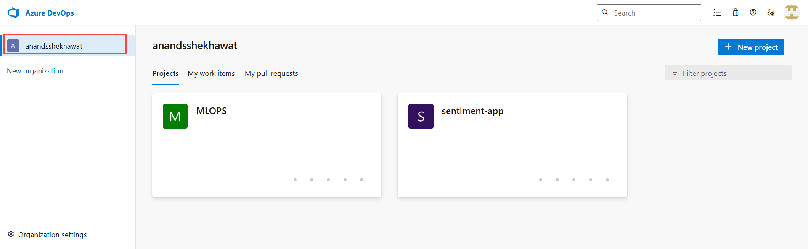
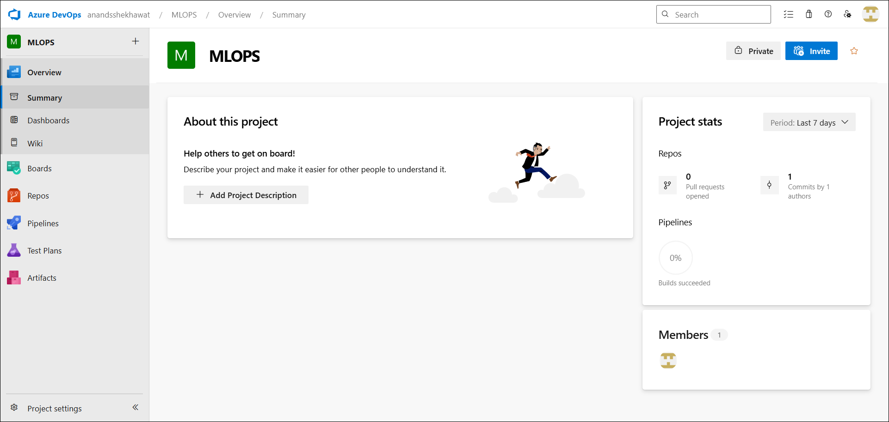
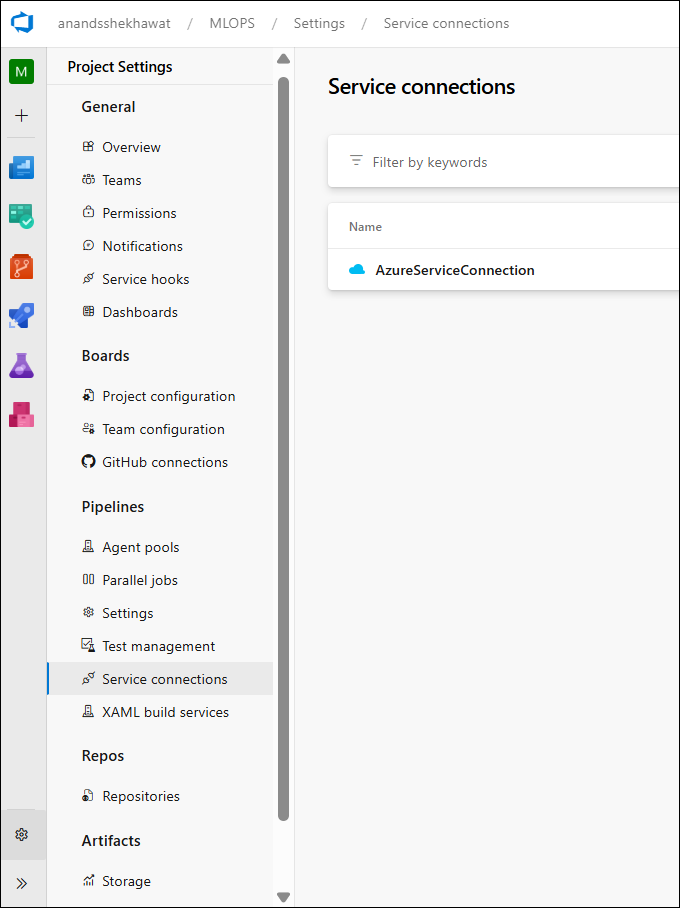

# Azure Devops

## Organization

In Azure DevOps, an Organization is the top-level container that holds everything related to your DevOps work.

```
Azure DevOps
   └── Organization
        ├── Project
        │     ├── Repos
        │     ├── Pipelines
        │     ├── Boards
        │     ├── Artifacts
        │     └── Wiki
        └── Project
```

### What an Organization Contains

An organization manages all DevOps resources such as:
| Component           | Purpose                                  |
| ------------------- | ---------------------------------------- |
| Projects            | Separate applications or systems         |
| Users & Permissions | Who can access projects                  |
| Repositories        | Source code storage                      |
| Pipelines           | CI/CD workflows                          |
| Boards              | Work tracking                            |
| Artifacts           | Package storage                          |
| Service connections | Integration with Azure or other services |

### Why Organizations Are Important

Organizations allow you to:

- Manage multiple projects in one place

- Control user access and permissions

- Share agents, pipelines, and resources

- Integrate with Azure subscriptions

    

## Project

In a project in Azure DevOps, the **Overview section** gives a high-level view of the project and quick access to collaboration tools. The left panel contains several components that help manage the entire **DevOps lifecycle**.

Below is a **concise explanation of each component and what popular tool it is similar to**.

| Component      | Purpose                                                                                                          | Similar To                           |
| -------------- | ---------------------------------------------------------------------------------------------------------------- | ------------------------------------ |
| **Overview**   | Provides a summary of the project including description, statistics, and member information.                     | Project dashboard                    |
| **Summary**    | Shows project information such as project description, activity stats, pipelines status, and members.            | Project homepage                     |
| **Dashboards** | Allows creation of customizable dashboards to track metrics, pipeline status, work items, and progress.          | Grafana / Jira dashboards            |
| **Wiki**       | A collaborative documentation space where teams can store guides, architecture notes, and project documentation. | Confluence / Notion documentation    |
| **Boards**     | Used to track work items such as tasks, bugs, and user stories with Kanban boards and backlogs.                  | Jira / Trello                        |
| **Repos**      | Source code repositories where developers store and manage code using Git.                                       | GitHub / GitLab                      |
| **Pipelines**  | CI/CD pipelines used to automatically build, test, and deploy applications.                                      | GitHub Actions / Jenkins / GitLab CI |
| **Test Plans** | Tool for managing manual and exploratory testing, test cases, and test runs.                                     | TestRail / Zephyr                    |
| **Artifacts**  | Package management for storing and sharing build artifacts such as npm, NuGet, or Maven packages.                | Nexus / JFrog Artifactory            |

### Example DevOps Workflow in Azure DevOps

```text
Boards → Track tasks and bugs
Repos → Store application code
Pipelines → Build and deploy application
Test Plans → Validate application
Artifacts → Store build packages
Wiki → Document the project
Dashboards → Monitor progress
```

### Simple Way to Remember

| Azure DevOps Tool | Think of it as |
| ----------------- | -------------- |
| Boards            | Jira           |
| Repos             | GitHub         |
| Pipelines         | Jenkins        |
| Wiki              | Confluence     |
| Artifacts         | Nexus          |
| Dashboards        | Grafana        |

✅ **In short:** Azure DevOps combines multiple tools into one platform so teams don't need separate tools for **code, planning, CI/CD, documentation, and testing**.



## Project Settings

In Azure DevOps, **Project Settings** is where you configure the **infrastructure, permissions, integrations, and resources** used by your DevOps project. These settings control how pipelines run, how code connects to external services, and how teams manage work.

### 1️⃣ Service Connections

#### What it is

A **Service Connection** is a **secure connection between Azure DevOps and external services** such as Azure, GitHub, Docker Hub, or Kubernetes.

It allows pipelines to **authenticate and deploy resources without exposing credentials in code**.

#### Example

Your screenshot shows:

```
AzureServiceConnection
```

This likely connects Azure DevOps to an **Azure subscription** so pipelines can deploy resources like:

* Azure App Service
* Azure VM
* Azure Kubernetes Service

#### Why we need it

Pipelines need permission to access external platforms.

Without a service connection:

```
Pipeline → cannot access Azure resources
```

With service connection:

```
Pipeline → authenticate → deploy resources
```

### Interview one-liner

> A Service Connection securely connects Azure DevOps pipelines to external services like Azure, allowing automated deployments.

## 2️⃣ Agent Pools

#### What it is

An **Agent Pool** is a **collection of machines (agents)** that run pipeline jobs.

When a pipeline runs:

```
Pipeline → Agent Pool → Agent → Executes tasks
```

The agent performs tasks like:

* Build code
* Run tests
* Deploy applications

## 3️⃣ Types of Agents

There are **two main types of agents**.

| Agent Type             | Description                                                       | Use Case                                     |
| ---------------------- | ----------------------------------------------------------------- | -------------------------------------------- |
| Microsoft-hosted agent | Managed by Microsoft and created automatically when pipelines run | Quick setup, no infrastructure management    |
| Self-hosted agent      | Installed and managed by you on your own VM or server             | Custom environment or private network access |

### Microsoft Hosted Agent

Example:

```
ubuntu-latest
windows-latest
macos-latest
```

Pipeline example:

```yaml
pool:
  vmImage: ubuntu-latest
```

Advantages:

* No setup required
* Automatically maintained
* Scales automatically

Limitation:

* Limited build minutes
* No custom environment

### Self Hosted Agent

Installed on:

* Azure VM
* On-prem server
* Local machine

Example architecture:

```
Azure DevOps
      │
      ▼
Self Hosted Agent (Linux VM)
      │
      ▼
Build / Deploy
```

Advantages:

* Full control
* Custom software
* Access to private networks

Example use case:

```
Deploy to private Kubernetes cluster
```
### 4️⃣ Parallel Jobs

#### What it is

Parallel jobs define **how many pipelines can run simultaneously**.

Example:

| Parallel Jobs | Meaning                              |
| ------------- | ------------------------------------ |
| 1             | Only one pipeline runs at a time     |
| 2             | Two pipelines can run simultaneously |

Example:

```
Build pipeline
Test pipeline
```

If parallel jobs = 1:

```
Test waits until build finishes
```

### 5️⃣ GitHub Connections

#### What it is

Used to connect Azure DevOps to **GitHub repositories**.

Purpose:

* Import GitHub repositories
* Trigger pipelines on GitHub commits

### 6️⃣ Repositories

Defines the **Git repositories used in the project**.

Features include:

* Code storage
* Branch policies
* Pull requests
* Version control

### 7️⃣ Test Management

Used for managing **manual testing workflows**.

Includes:

* Test cases
* Test plans
* Test runs
* Bug tracking


### Simple Architecture

```
Azure DevOps Project
      │
      ├── Repositories → Code
      ├── Pipelines → CI/CD
      │        │
      │        ▼
      │     Agent Pool
      │        │
      │        ▼
      │     Agent executes tasks
      │
      └── Service Connection → Connect to Azure
```

### What is a Service Connection?

> A Service Connection is a secure authentication mechanism that allows Azure DevOps pipelines to connect to external services like Azure, Docker, or Kubernetes.

### What is an Agent Pool?

> An Agent Pool is a group of build agents that run pipeline jobs.

### What are the types of agents?

1. Microsoft-hosted agents
2. Self-hosted agents

### Why do we need agents?

> Agents execute pipeline tasks such as building code, running tests, and deploying applications.

---

✅ **In one line**

```
Service Connection → Authentication to external services
Agent Pool → Where pipelines run
Agent → Machine executing pipeline tasks
```


