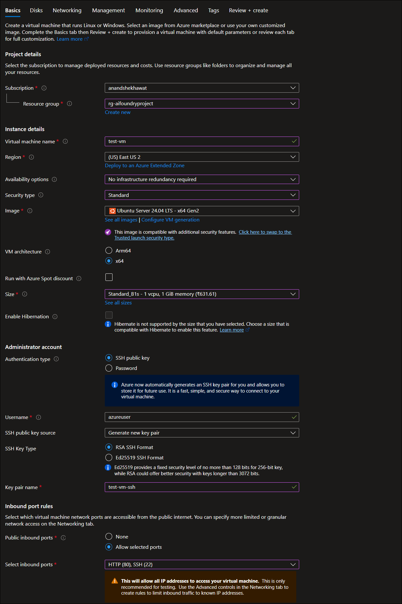
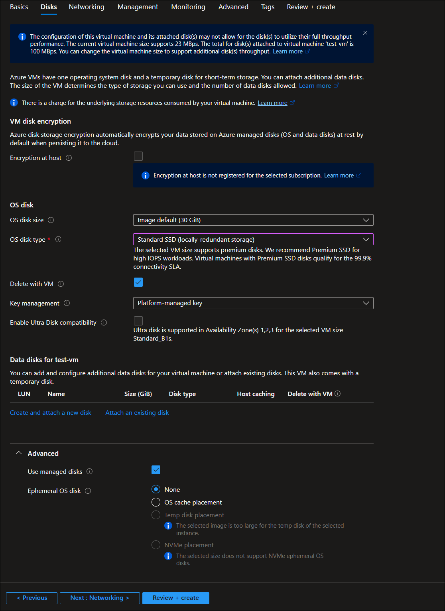
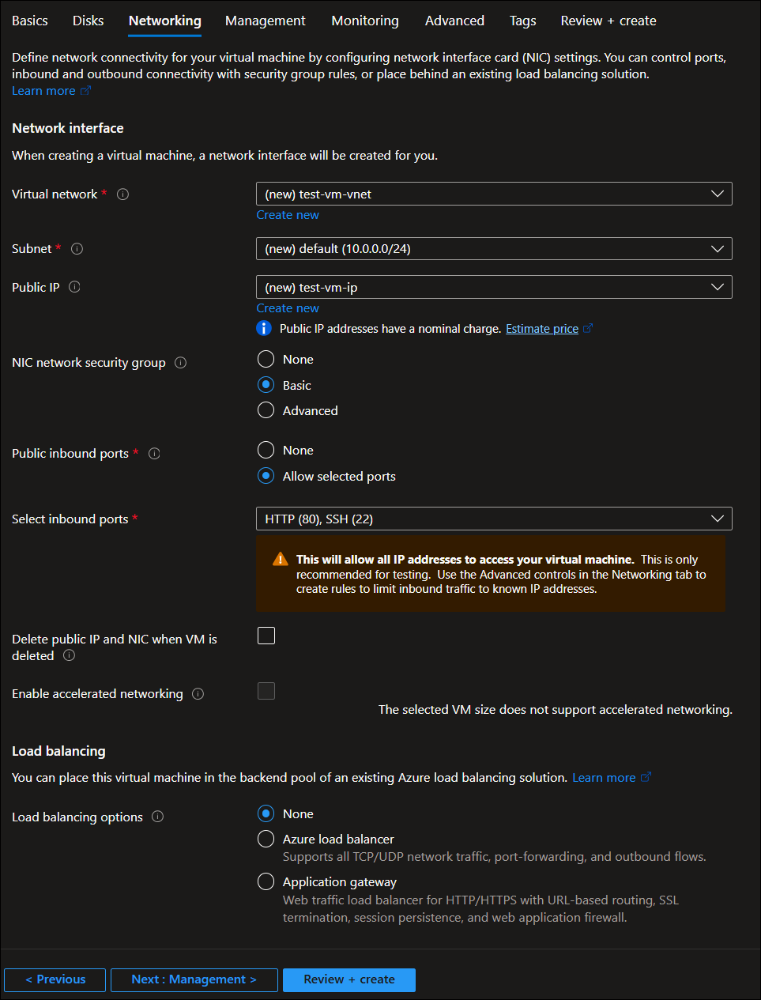
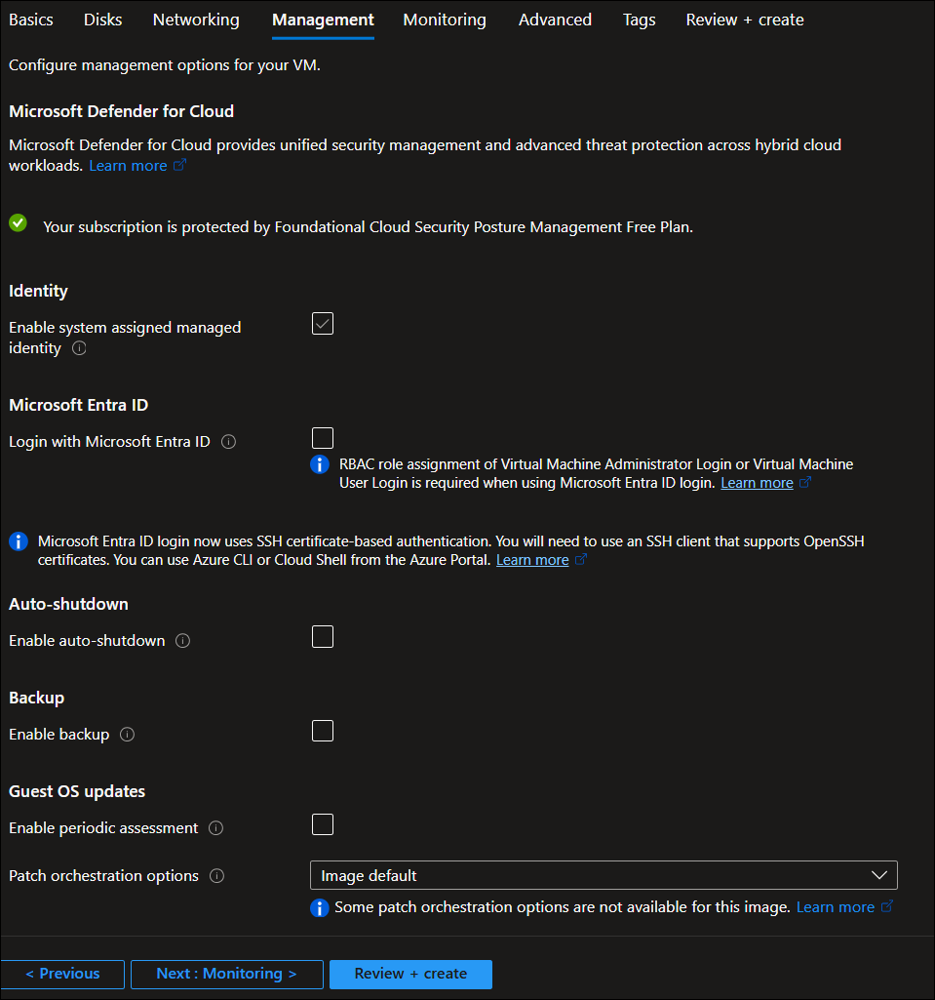
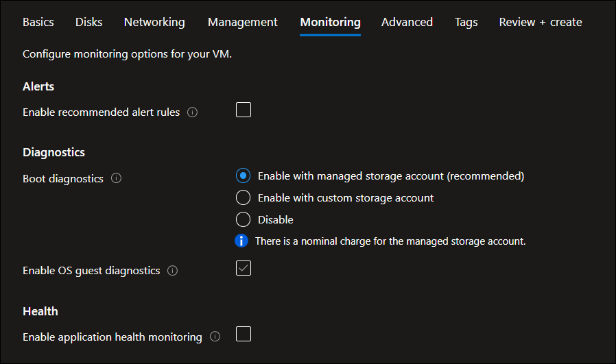
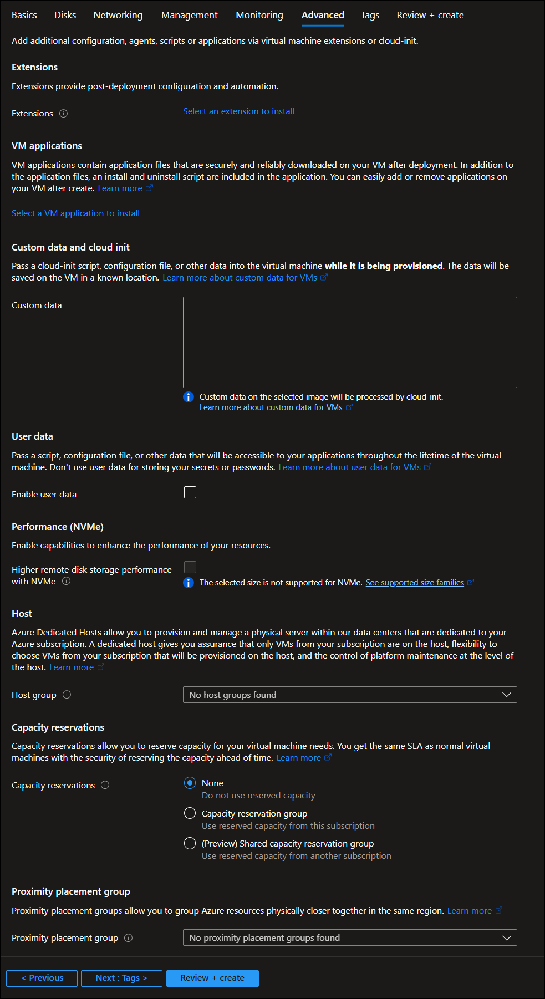

# Create VM
When creating a **Virtual Machine in Microsoft Azure**, the portal exposes several configuration sections (tabs). Even if you choose **Ubuntu instead of Windows**, the main options remain similar. The difference is mainly in how you **connect (SSH instead of RDP)** and what software you install afterward.

Below are the **important configuration options available when creating a VM**, with a short explanation of why each matters.

## 1️⃣ Basics (Core VM Settings)

This is the most important section because it defines **what VM you create and where it runs**.

| Option               | What it Controls                | Example                       |
| -------------------- | ------------------------------- | ----------------------------- |
| Subscription         | Azure account billing scope     | Azure Subscription 1          |
| Resource Group       | Logical container for resources | `myRGVM`                      |
| Virtual Machine Name | Unique name of the VM           | `myUbuntuVM`                  |
| Region               | Azure datacenter location       | East US / West Europe         |
| Availability Options | High availability setup         | Availability Zone             |
| Image                | Operating system                | Ubuntu 22.04 / Windows Server |
| Size                 | CPU, RAM, and performance       | Standard_B2s                  |
| Authentication Type  | Login method                    | SSH key / Password            |
| Inbound Ports        | Network access rules            | SSH (22), HTTP (80)           |



## 2️⃣ Disks (Storage Configuration)


| Option                              | Description                                                                                                                  | Typical Usage                                                                    |
| ----------------------------------- | ---------------------------------------------------------------------------------------------------------------------------- | -------------------------------------------------------------------------------- |
| **Encryption at host**              | Encrypts VM data at the physical host level before it is written to Azure storage. Adds an extra layer of security.          | Used for highly secure workloads or compliance requirements.                     |
| **OS disk size**                    | Specifies the size of the operating system disk used by the VM. Default usually comes from the selected image.               | Increase if the OS or applications require more storage.                         |
| **OS disk type**                    | Determines the storage performance tier for the OS disk (Standard HDD, Standard SSD, Premium SSD, etc.).                     | SSD for better performance, HDD for cheaper storage.                             |
| **Delete with VM**                  | If enabled, the OS disk will be automatically deleted when the VM is deleted.                                                | Useful for labs or temporary environments.                                       |
| **Key management**                  | Specifies how disk encryption keys are managed (Platform-managed or Customer-managed keys).                                  | Platform-managed for simplicity; customer-managed for advanced security control. |
| **Enable Ultra Disk compatibility** | Allows the VM to attach Ultra SSD disks for extremely high performance workloads.                                            | Used for high IOPS workloads like databases.                                     |
| **Data disks for VM**               | Additional disks that can be attached to the VM for storing application data, logs, or databases.                            | Used when extra storage beyond the OS disk is required.                          |
| **Create and attach a new disk**    | Creates a new empty disk and attaches it to the VM.                                                                          | For adding storage for applications or databases.                                |
| **Attach an existing disk**         | Attaches a previously created managed disk to the VM.                                                                        | Used when reusing storage from another VM.                                       |
| **Use managed disks**               | Enables Azure to manage storage accounts automatically for VM disks.                                                         | Recommended option for most deployments.                                         |
| **Ephemeral OS disk**               | Stores the OS disk on the local VM storage instead of persistent Azure storage. Faster but data is lost if VM is redeployed. | Used for stateless workloads or CI/CD environments.                              |
| **OS cache placement**              | Places the ephemeral OS disk in the VM cache for faster access.                                                              | Used for performance optimization.                                               |
| **Temp disk placement**             | Places the OS disk in temporary local storage of the VM.                                                                     | Used for workloads where OS persistence is not required.                         |
| **NVMe placement**                  | Stores the OS disk on NVMe storage for extremely fast disk access.                                                           | Used for high-performance compute scenarios.                                     |



## 3️⃣ Networking (Connectivity)

| Option                                          | Description                                                                                                  | Typical Usage                                                      |
| ----------------------------------------------- | ------------------------------------------------------------------------------------------------------------ | ------------------------------------------------------------------ |
| **Virtual network (VNet)**                      | The private network where the VM will be deployed. It allows communication between Azure resources securely. | Used to group VMs and services within the same private network.    |
| **Subnet**                                      | A segmented portion of the virtual network that organizes and isolates resources.                            | Used to separate tiers like web, application, and database layers. |
| **Public IP**                                   | Assigns a public IP address so the VM can be accessed from the internet.                                     | Required for remote access (SSH or RDP) and public web hosting.    |
| **NIC Network Security Group (NSG)**            | A firewall that controls inbound and outbound traffic to the VM’s network interface.                         | Used to allow or block traffic based on security rules.            |
| **Public inbound ports**                        | Determines whether the VM accepts incoming internet traffic.                                                 | Usually configured to allow only necessary ports.                  |
| **Select inbound ports**                        | Specifies which ports should be open to the public (e.g., SSH or HTTP).                                      | Example: SSH (22) for Linux login, HTTP (80) for web access.       |
| **Delete public IP and NIC when VM is deleted** | Automatically deletes the network interface and public IP when the VM is removed.                            | Useful in temporary environments or labs.                          |
| **Enable accelerated networking**               | Improves network performance by reducing latency and CPU overhead using Azure’s SR-IOV technology.           | Used for high-performance or network-intensive applications.       |
| **Load balancing options**                      | Allows the VM to be added to a load balancing setup for distributing traffic.                                | Used in scalable applications with multiple VMs.                   |
| **Azure Load Balancer**                         | Distributes TCP/UDP traffic across multiple VMs to improve availability and performance.                     | Used for backend services or APIs.                                 |
| **Application Gateway**                         | A web traffic load balancer that supports HTTP/HTTPS, SSL termination, and web application firewall.         | Used for web applications needing advanced routing and security.   |

**Important note from the warning shown in the screenshot:**
Opening ports like **SSH (22)** or **HTTP (80)** allows access from **any IP address on the internet**, which is acceptable for **testing environments**, but in production it is recommended to restrict access using **Network Security Group rules**.



## 4️⃣ Management


| Option                               | Description                                                                                                                              | Typical Usage                                                                 |
| ------------------------------------ | ---------------------------------------------------------------------------------------------------------------------------------------- | ----------------------------------------------------------------------------- |
| **Microsoft Defender for Cloud**     | Provides security monitoring, vulnerability assessment, and threat protection for cloud resources.                                       | Used to improve VM security and detect threats.                               |
| **System-assigned managed identity** | Automatically creates an identity for the VM in Microsoft Entra ID so it can securely access Azure services without storing credentials. | Used when the VM needs to access services like Key Vault or Storage securely. |
| **Login with Microsoft Entra ID**    | Allows users to authenticate to the VM using Azure Active Directory (Microsoft Entra ID) instead of local credentials.                   | Used in enterprise environments for centralized identity management.          |
| **Enable auto-shutdown**             | Automatically shuts down the VM at a specified time each day.                                                                            | Helps reduce costs in lab or development environments.                        |
| **Enable backup**                    | Enables Azure Backup to protect the VM and its data by creating recovery points.                                                         | Used for disaster recovery and data protection.                               |
| **Enable periodic assessment**       | Allows Azure to periodically check the VM for missing updates or security vulnerabilities.                                               | Used to maintain system security and compliance.                              |
| **Patch orchestration options**      | Defines how operating system updates and patches are installed on the VM. Options include automatic updates or manual control.           | Used to manage OS updates for stability and security.                         |

**Important note:**
Options like **Managed Identity, Entra ID login, and Backup** are typically enabled in **production environments**, while **Auto-shutdown** is commonly used in **testing or lab environments to reduce cost**.




## 5️⃣ Monitoring

| Option                                   | Description                                                                                                    | Typical Usage                                                          |
| ---------------------------------------- | -------------------------------------------------------------------------------------------------------------- | ---------------------------------------------------------------------- |
| **Enable recommended alert rules**       | Automatically creates alert rules to notify you when certain VM metrics exceed thresholds (CPU, memory, etc.). | Used for proactive monitoring and notifications.                       |
| **Boot diagnostics**                     | Captures screenshots and logs during the VM boot process to help troubleshoot startup issues.                  | Useful when a VM fails to start or crashes during boot.                |
| **Enable with managed storage account**  | Stores boot diagnostic logs in an Azure-managed storage account (recommended option).                          | Simple setup with minimal configuration.                               |
| **Enable with custom storage account**   | Stores boot diagnostic logs in a user-created storage account.                                                 | Used when organizations want centralized storage management.           |
| **Disable boot diagnostics**             | Turns off boot logging and diagnostics collection.                                                             | Typically used in basic labs or cost-sensitive scenarios.              |
| **Enable OS guest diagnostics**          | Collects detailed performance data and logs from inside the VM’s operating system.                             | Used for monitoring VM performance and troubleshooting.                |
| **Enable application health monitoring** | Tracks the health status of applications running inside the VM.                                                | Useful in production workloads or when integrated with load balancers. |

**Important note:**
Boot diagnostics and guest diagnostics help administrators **troubleshoot VM issues and monitor performance**, especially in production environments.



## 6️⃣ Advanced Settings

| Option                                               | Description                                                                                                 | Typical Usage                                                               |
| ---------------------------------------------------- | ----------------------------------------------------------------------------------------------------------- | --------------------------------------------------------------------------- |
| **Extensions**                                       | Allows installation of VM extensions to automate configuration or install software after VM deployment.     | Used to install monitoring agents, security tools, or custom scripts.       |
| **VM applications**                                  | Enables deployment of packaged applications directly to the VM during or after provisioning.                | Used for automated application installation across multiple VMs.            |
| **Custom data (Cloud-init)**                         | Allows passing scripts or configuration files during VM provisioning to automatically configure the VM.     | Commonly used in Linux VMs for automated setup (e.g., installing packages). |
| **User data**                                        | Stores configuration data accessible to applications running inside the VM during its lifetime.             | Used for application configuration or runtime parameters.                   |
| **Higher remote disk storage performance with NVMe** | Enables improved storage performance using NVMe-based disks for supported VM sizes.                         | Used for high-performance workloads requiring faster disk I/O.              |
| **Host group (Azure Dedicated Host)**                | Allows the VM to run on dedicated physical servers reserved for your subscription.                          | Used for compliance, licensing, or isolation requirements.                  |
| **Capacity reservations**                            | Reserves compute capacity for VMs in advance to guarantee availability when needed.                         | Used in production environments where capacity must be guaranteed.          |
| **Proximity placement group**                        | Places Azure resources physically close to each other within the same datacenter to reduce network latency. | Used in high-performance applications like HPC or distributed systems.      |

**Important note:**
Most of these advanced options are typically used in **large-scale or production environments**, while **basic labs and development setups usually leave these settings at their default values**.




## 7️⃣ Tags

Used for **organization and cost tracking**.

Example:

```text
Environment = Dev
Owner = Anand
Project = AI-Lab
```

Tags help with:

* cost tracking
* resource grouping
* automation

---

