# ML 

**Decision Trees with Azure SQL and Azure ML Designer:**: https://experience.cloudlabs.ai/#/labguidepreview/e416effb-aa7b-4caa-9577-9622868d57c5/2

**AI-900 : Explore Automated Machine Learning in Azure Machine Learning:** https://experience.cloudlabs.ai/#/labguidepreview/3c0f333d-6f6d-4800-83a4-cb6169ae1a2b/2

## Create Compute Cluster

1. We will be creating a **compute cluster**, which we will use to **run notebooks, write and execute code, and perform model training in a managed cloud environment without relying on local machine resources**.

    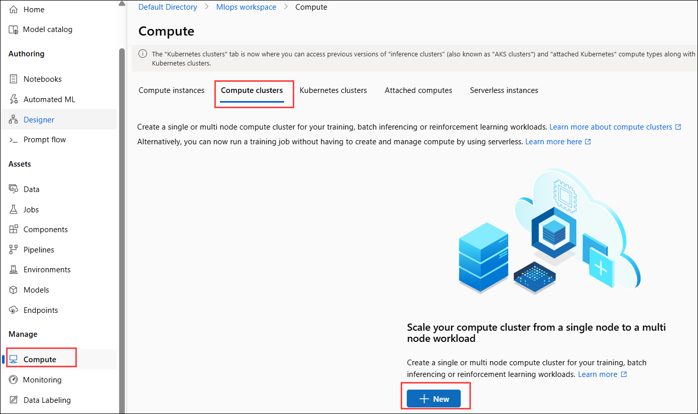

    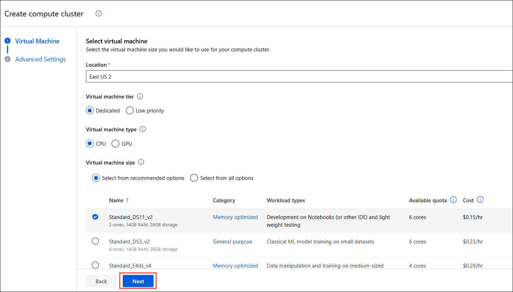

1. Following values and their purpose: 

    * **Compute name**: Unique name of the compute cluster used to identify and reference it in jobs and pipelines

    * **Minimum number of nodes**: Defines the minimum number of virtual machines that will always be running; setting it to 0 helps reduce cost when idle

    * **Maximum number of nodes**: Specifies the maximum number of machines the cluster can scale up to based on workload demand

    * **Idle seconds before scale down**: Determines how long the cluster waits before automatically shutting down idle nodes to optimize cost

    * **Enable SSH access**: Allows secure remote access to cluster nodes for debugging or manual configuration (optional)

    * **Enable virtual network**: Connects the compute cluster to a private network for secure and controlled access

    * **Assign a managed identity**: Provides the cluster with an Azure identity to securely access other resources without storing credentials

    * **Add tags**: Key-value pairs used for organizing resources, cost tracking, and management

    * **Create**: Provisions the compute cluster with the selected configuration

        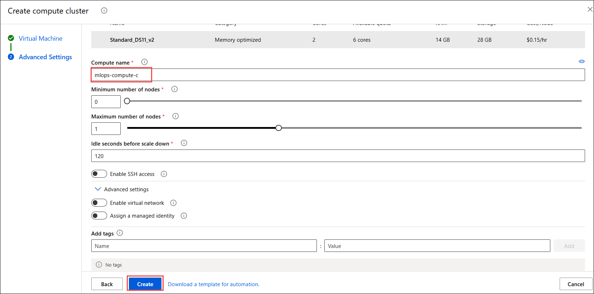

## Upload Data asset

1. Download and extract the contents of the folder from https://aka.ms/mslearn-ml-data, extract the downloaded ml-data.zip archive to see the files it contains.

1. Data assets allow you to register datasets (files, folders, or tables) so they can be easily reused across experiments, pipelines, and training jobs

    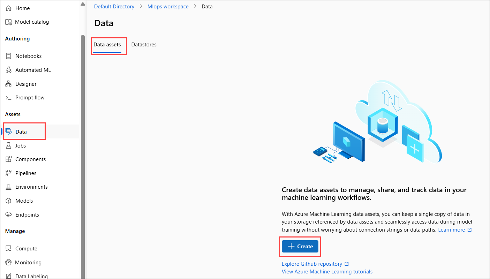

1. Following field means:

    * Provide a **Name** for the data asset (e.g., `mlops-data`)

    * (Optional) Add a **Description** to describe the dataset

    * Under **Type**, select **Tabular**

    * Used when the data is structured (e.g., CSV, Excel, tables)

    * Click **Next** to proceed

    * This step defines how Azure ML will interpret and use the data in downstream tasks like training and analysis

        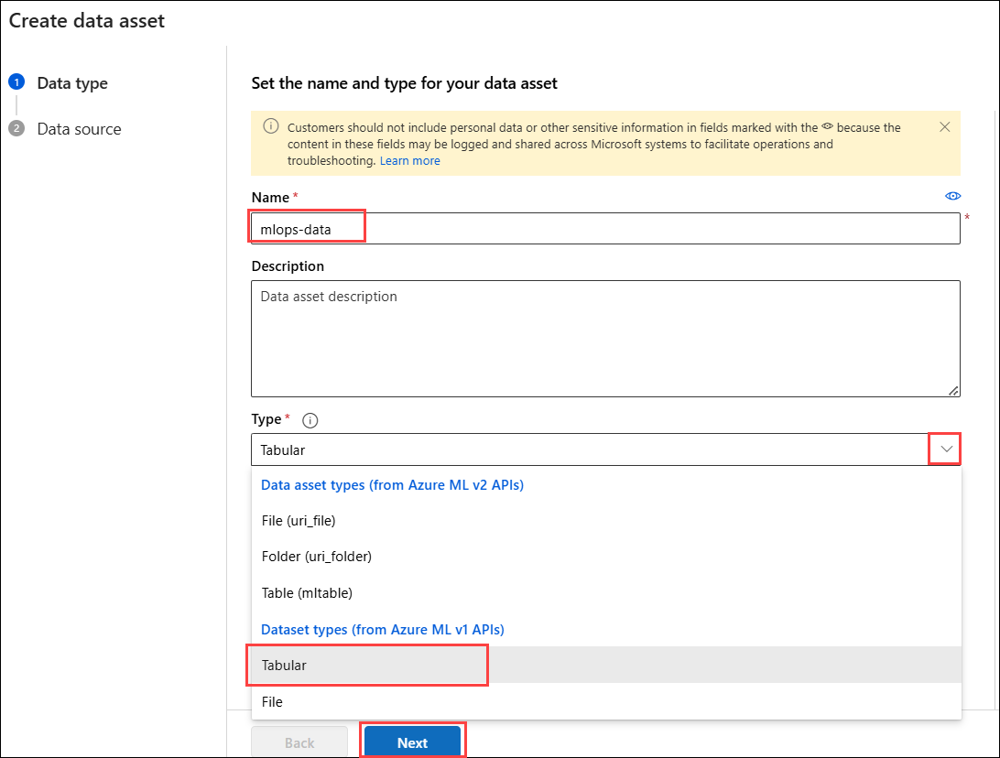

1. Now:

    * In the **Data source** step, select **From local files**

    * This option allows you to **upload data directly from your local system**

    * It is useful when your dataset is not already available in Azure storage

    * You can upload files such as **CSV, Excel, or other supported formats**

    * Once uploaded, the data will be stored in the workspace storage and registered as a data asset

    * Click **Next** to proceed to upload and configure the dataset

        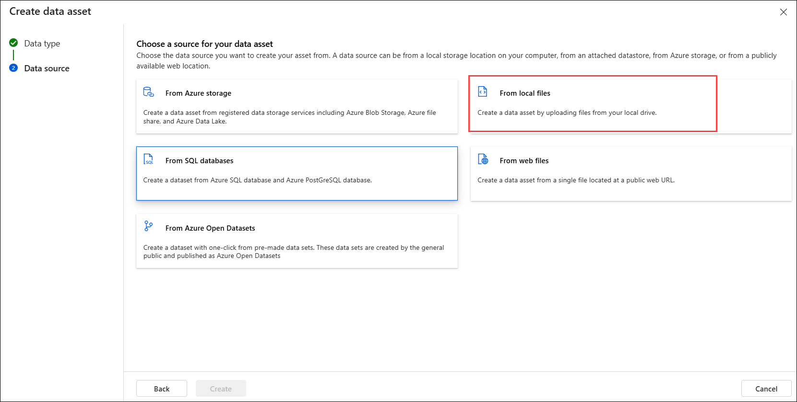

1. Now:

    * In the **Destination storage type** step, select **Azure Blob Storage** as the datastore type

    * Choose the default datastore **workspaceblobstore**

    * This is the primary storage associated with the workspace

    * Datastores define **where your uploaded data will be stored in Azure**

    * Using the default datastore ensures **seamless integration with ML workflows**

    * Click **Next** to proceed

        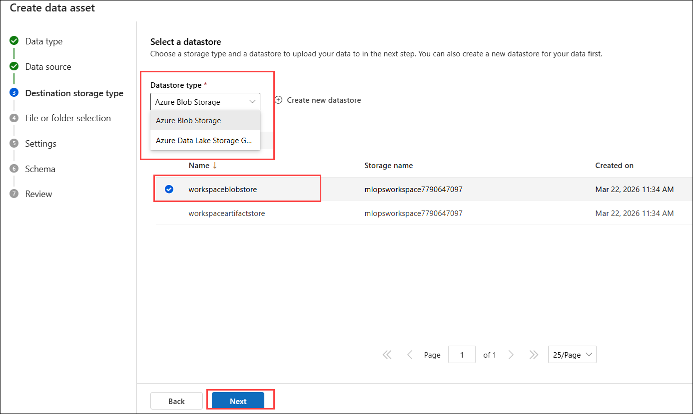

1. Now

    * In the **File or folder selection** step, click **Upload files or folder**

    * Browse and select the dataset file from your local system (e.g., `ice-cream.csv`)

    * Click **Open** to upload the file

    * The selected file will appear under the **Upload list**, confirming successful upload

    * Optionally, enable **Overwrite if already exists** if you want to replace an existing file

    * Click **Next** to proceed

        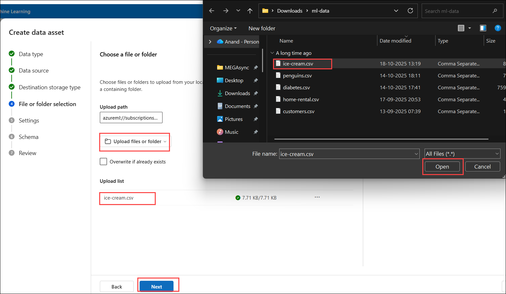

1. Now:

    * In the **Settings** step, keep the default configuration for parsing the data

    * **File format**: Set to **Delimited** (used for CSV files)

    * **Delimiter**: Keep as **Comma**, since the file is comma-separated

    * **Encoding**: Keep as **UTF-8** (standard encoding)

    * **Column headers**: Ensure **All files have same headers** is selected

    * **Skip rows**: Keep as **None** unless the file contains extra rows at the top

    * Review the **Data preview** to confirm that the data is correctly parsed and columns are properly displayed

    * Click **Next** to proceed

        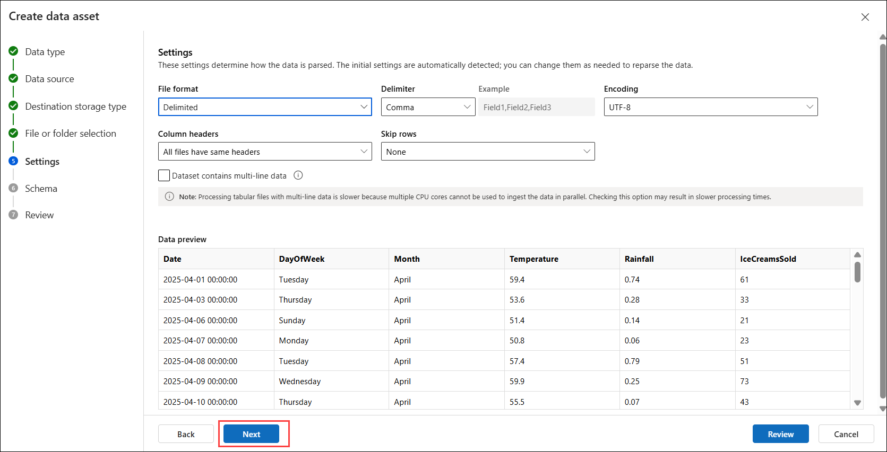

1. On the Create data asset 
    - Schema page,Include only the following columns (1) (Date is unique for each row, and adds little predictive capability on its own):
        - DayOfWeek
        - Month
        - Temperature
        - Rainfall
        - IceCreamsSold
    - review detected columns and types, then click Next (2)
    - Then click on **Create**

        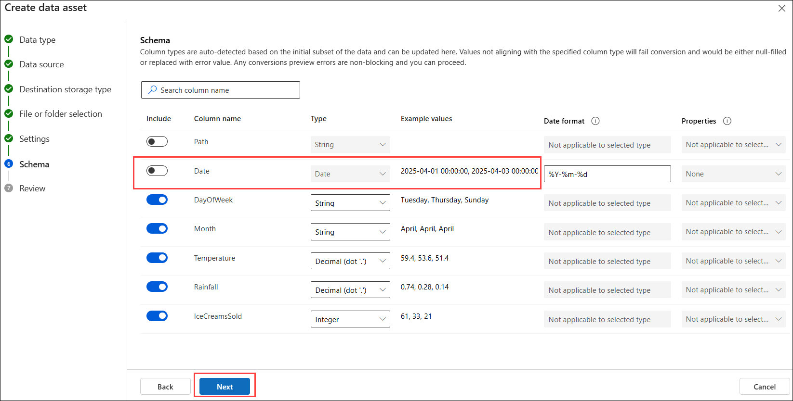

        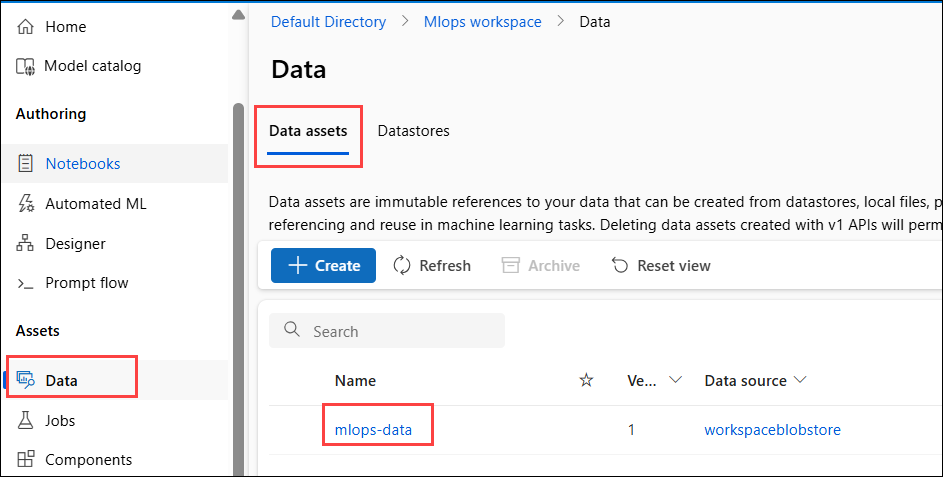

1. After the data asset has been created:

    * Once the data asset is created, you can view its details under the **Details** tab

        * Shows metadata such as type, size, datastore, and version

    * Navigate to the **Consume** tab

        * Provides sample code (Python SDK) to **access the dataset programmatically** in notebooks or scripts

    * Navigate to the **Explore** tab

        * Displays a **preview of the dataset**, including columns and sample rows
        * Helps verify that the data is correctly uploaded and parsed

    * The **Models** tab

        * Will show models that are trained using this dataset
        * Currently empty since no models have been created yet

    * The **Jobs** tab

        * Will display training or processing jobs that used this dataset
        * Currently empty as no jobs have been executed yet

    * This confirms that the data asset is successfully created and ready to be used in ML workflows

        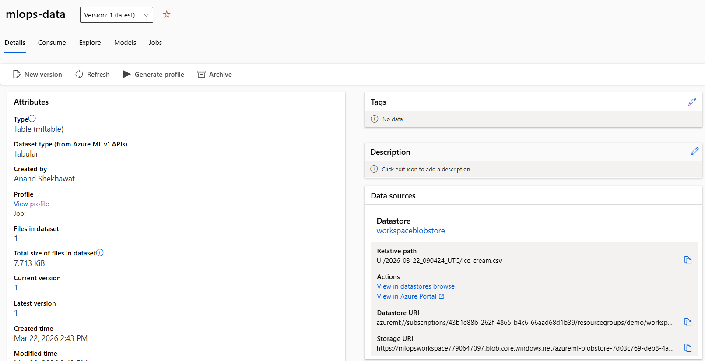

        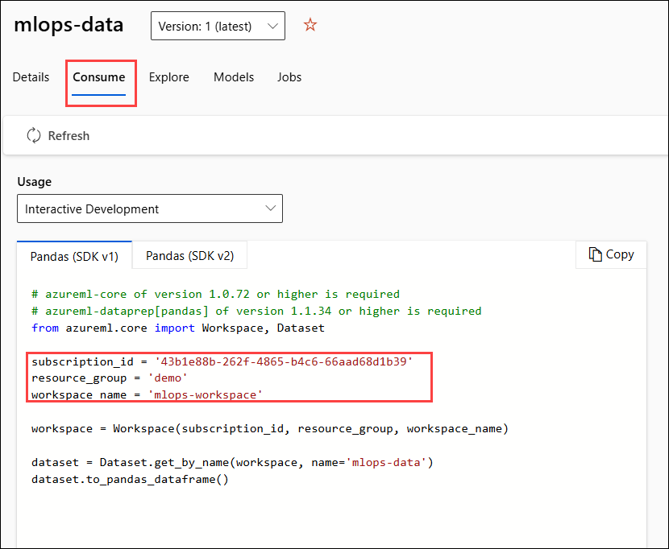

        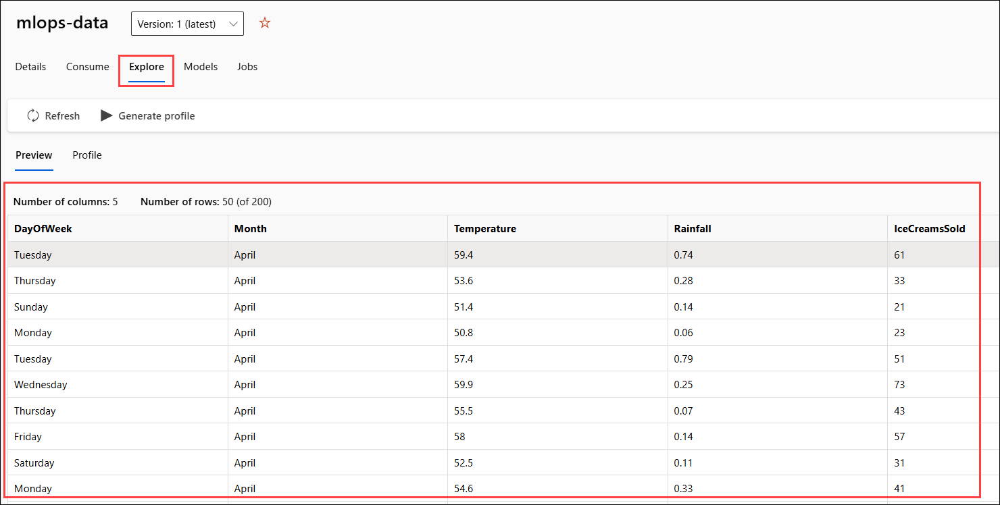

## Create Automated ML job

1. Now
    * Navigate to **Automated ML** from the left pane and click **+ New Automated ML job**
    * Under **Task type & data**, select **Regression** as the task type and choose the dataset **mlops-data**, then click **Next**
    * In **Task settings**, select **IceCreamsSold** as the **target column**
    * Click **View additional configuration settings**, set **Primary metric** to **R2Score**, keep default model selections (e.g., RandomForest, LightGBM), and click **Save**
    * Expand **Limits**, set **Max Nodes** to **1**,  **Metric score threshold** to **0.9** and **Experiment timeout** to **15 minutes**, keep other settings as default
    * Under **Validation type**, keep **Automatic** and click **Next**
    * In the **Compute** step, select **Compute cluster** and choose the created cluster (e.g., `mlops-compute-c`), then click **Next**
    * In the **Review** step, verify the configuration and submit the job
    * The Automated ML job will train multiple models, evaluate them, and automatically select the best model based on **R2Score**

        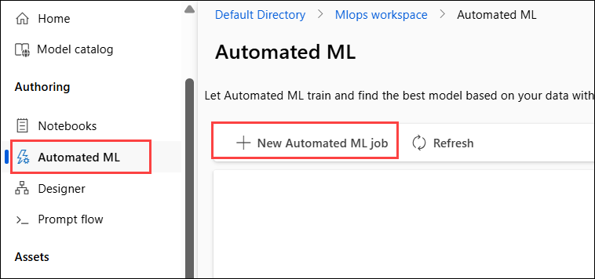

        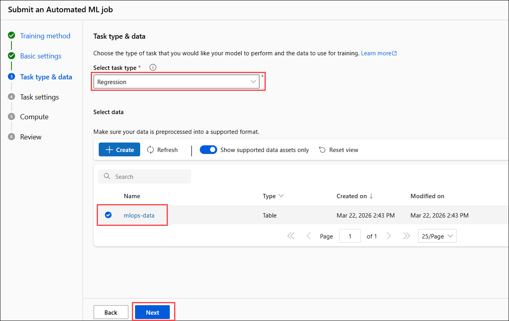

        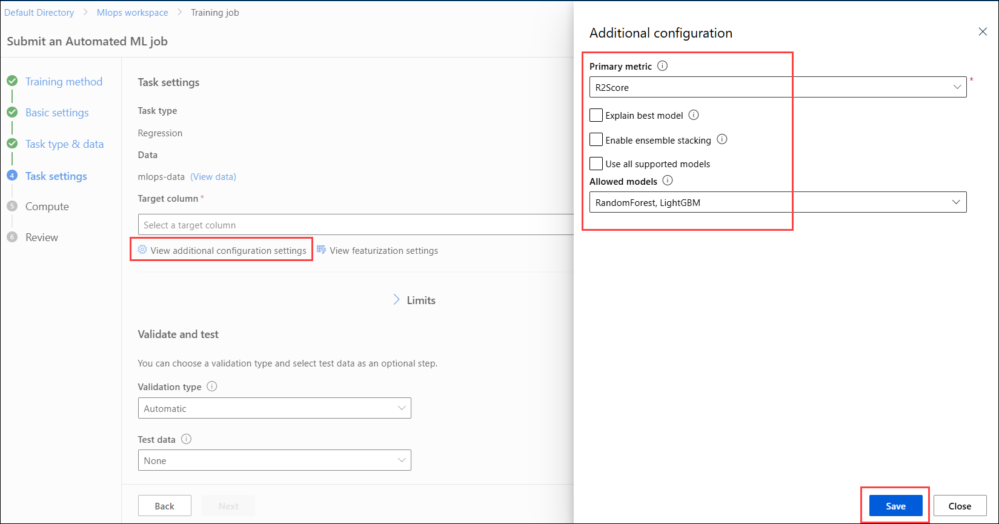

        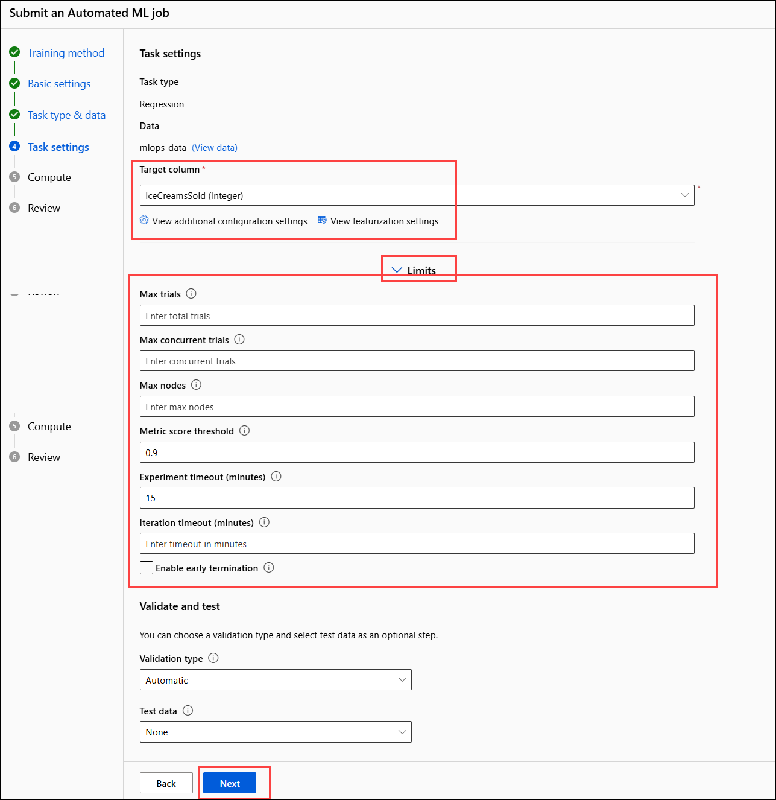

        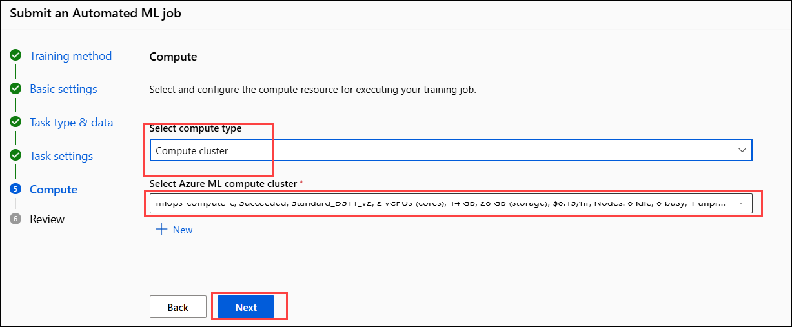

        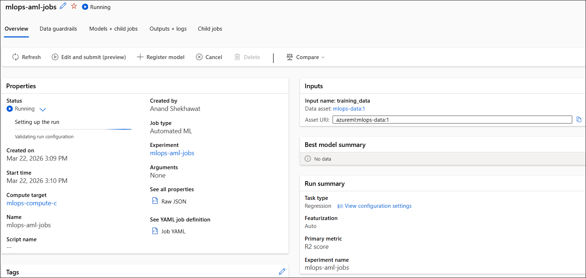

1. It will take around 10mins to complete.

1. Now:

    * The **outputs** folder contains all files generated during the Automated ML run

    * The **_automl_internal** folder stores internal artifacts used by Azure ML for processing and tracking

    * Files like **ExperimentData_*.pkl** and **ExperimentMetadata_*.pkl** are system-generated and used for experiment execution and reproducibility

    * These files are not meant for manual modification and are handled automatically by Azure ML

    * Once the run is complete, the **best performing model can be registered from the run**

    * Registering the model allows you to **version, manage, and deploy it later as an endpoint**

    * This is an important step to move from experimentation to production in the ML lifecycle

        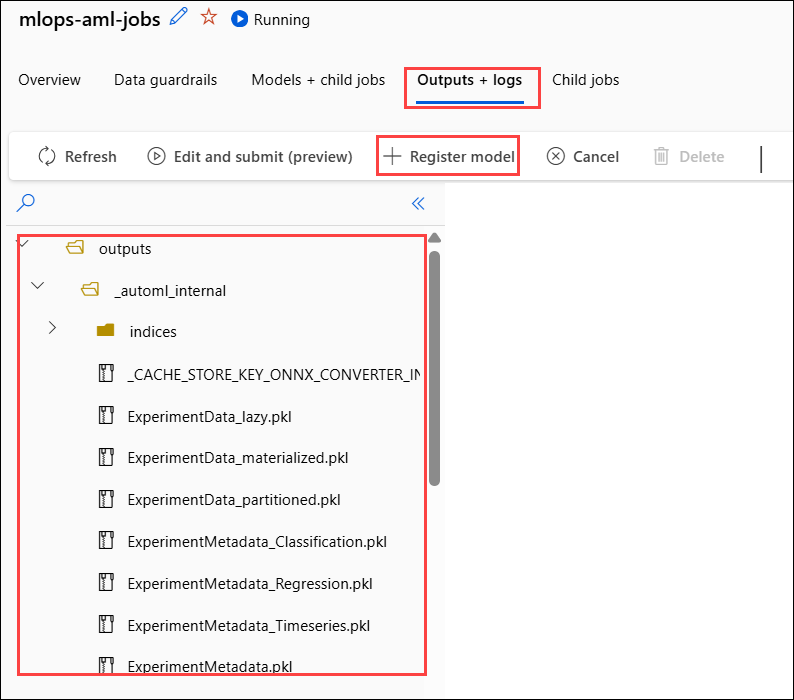

        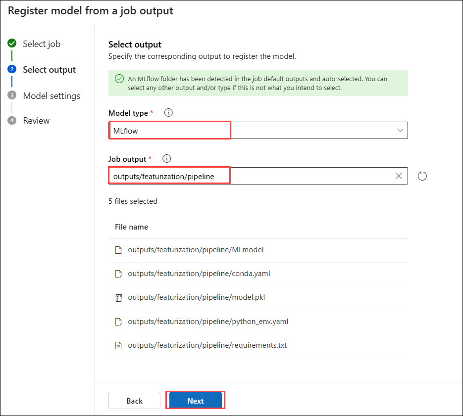

        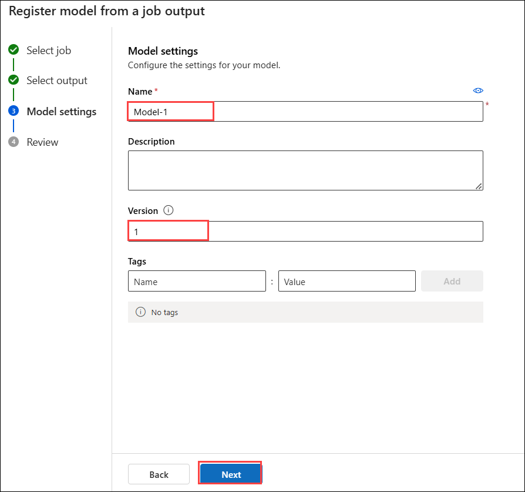

        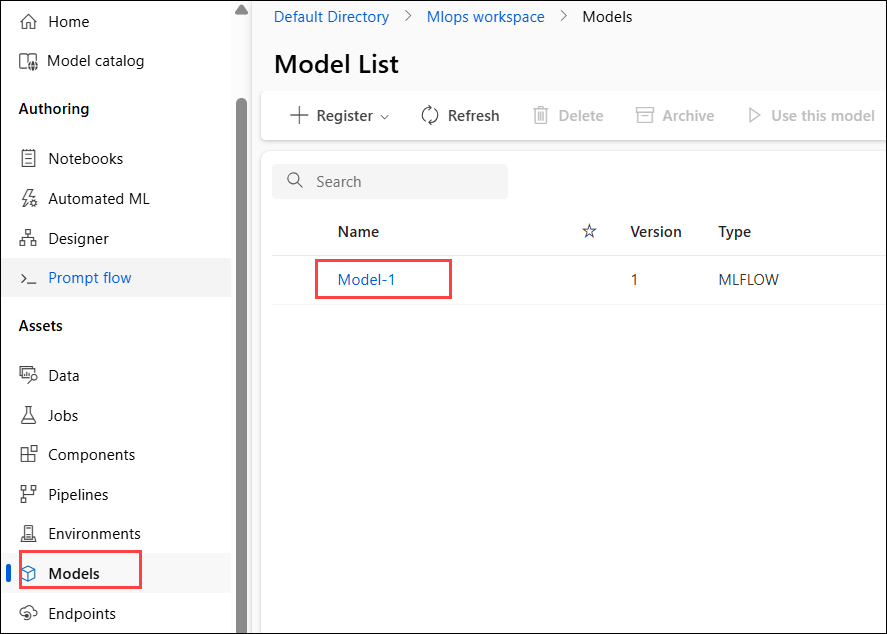

1. Now we can deloy the endpoint from this model.

    * The **Use this model** option allows you to deploy the trained model for real-world usage

    * **Real-time endpoint** is used to deploy the model for instant predictions (low latency), ideal for applications like APIs, dashboards, or user-facing apps

    * **Batch endpoint** is used for processing large volumes of data in bulk, suitable for scheduled jobs or offline predictions

    * Deploying an endpoint converts the trained model into a **consumable service** that can receive input data and return predictions

    * Without deployment, the model remains only as a stored artifact and **cannot be used by applications or external systems**

    * Endpoints provide a **secure and scalable way** to expose your model via REST APIs

    * They enable **integration with other services**, such as web apps, mobile apps, or enterprise systems

    * Deployment also allows **monitoring, logging, and version control** of the model in production

    * In short, deploying an endpoint is necessary to **move from training (development) to inference (production use)**

        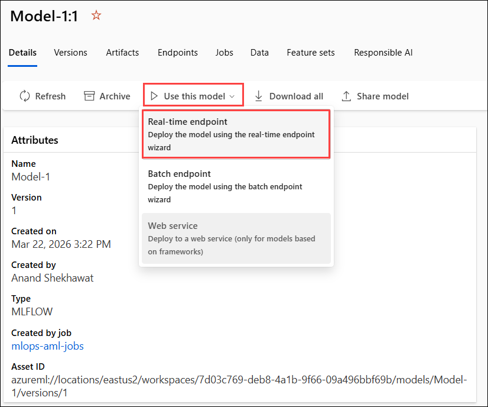

1. Now:
    * **Project Name**: Indicates the Azure ML workspace/project under which the deployment is being created

    * **Instance count**: Defines how many instances (replicas) of the model will run; more instances improve scalability and handle higher request load

    * **Virtual machine**: Specifies the compute size used for deployment; determines CPU, RAM, and cost, and should be chosen based on model complexity and performance needs

    * **Endpoint (New / Existing)**: Allows you to either create a new endpoint or reuse an existing one to host the model

    * **Endpoint name**: Unique name for the endpoint; this will be used to generate the scoring API URL

    * **Endpoint URL**: The REST API endpoint where requests are sent to get predictions from the deployed model

    * **Deployment name**: Name of the specific deployment under the endpoint; useful when managing multiple versions of a model under the same endpoint

    * **Inferencing data collection**: Option to collect input/output data during inference for monitoring and debugging purposes

    * **Package Model**: Packages the model along with its dependencies for easier portability and reuse

    * Overall, these settings control how your model is **hosted, scaled, accessed, and monitored in production**

        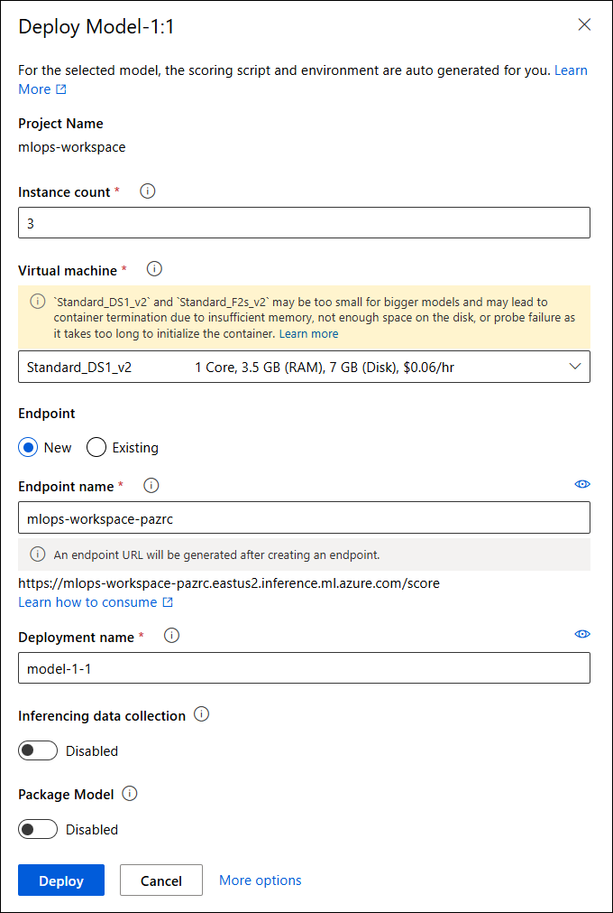

1. Now you can see the details of the endpoint deployed:

    * The deployment has been successfully created and is now available as a **live endpoint**

    * **Provisioning state: Succeeded** indicates that the endpoint is ready to receive requests

    * **REST endpoint** is the main API URL used to send input data and get predictions from the model

    * This endpoint can be integrated with applications like web apps, mobile apps, or backend systems

    * **Swagger URI** provides an interactive interface to test the API and understand request/response formats

    * It helps developers quickly validate the model without writing code

    * **Authentication type (Key)** means the endpoint is secured and requires an access key to make requests

    * **Instance count (3)** shows that multiple replicas are running to handle load and ensure high availability

    * **Scaling options** allow automatic adjustment of resources based on traffic

    * **Logs and Metrics** help monitor performance, troubleshoot issues, and track usage

    * At this stage, the model is fully operational and can be used for **real-time predictions in production environments**

       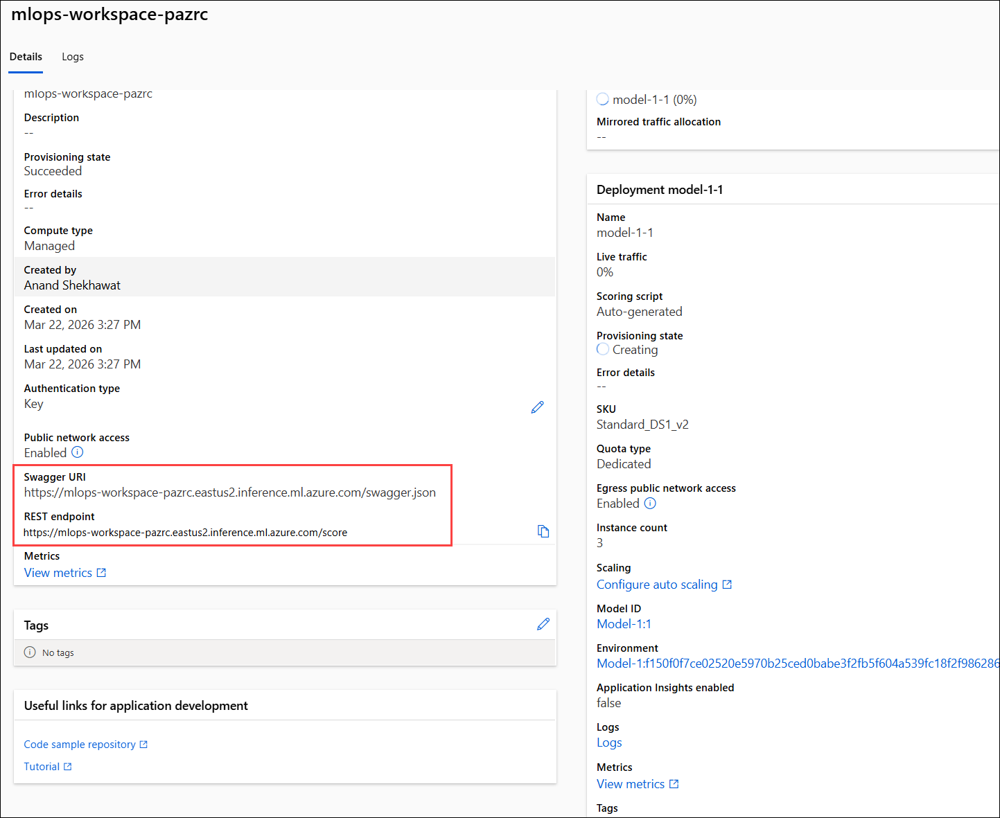 