# Azure Machine Learning

It is a cloud-based platform on Microsoft Azure used to build, train, deploy, and manage machine learning models at scale.

It provides tools for data scientists, ML engineers, and developers to manage the entire machine learning lifecycle (MLOps) in one place.

>Azure Machine Learning is a cloud service that helps teams build, train, deploy, and monitor machine learning models using scalable infrastructure and integrated tools.

### What You Can Do with Azure Machine Learning

Azure ML supports the full ML lifecycle.
| Stage               | What Azure ML Provides                     |
| ------------------- | ------------------------------------------ |
| Data preparation    | Data storage and dataset management        |
| Model training      | Training models using scalable compute     |
| Experiment tracking | Track experiments, parameters, and metrics |
| Model management    | Register and version models                |
| Deployment          | Deploy models as APIs or batch jobs        |
| Monitoring          | Monitor model performance in production    |


## Main Components of Azure Machine Learning

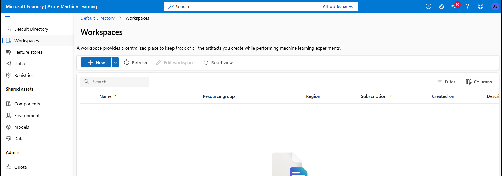

The screenshot shows the **left navigation pane of Azure Machine Learning inside Microsoft Foundry**. These sections help manage different parts of the **machine learning lifecycle (data → training → deployment → management)**.

Below is a **simple explanation of each item with an interview-friendly description**.

### Default Directory

**What it is:**
Represents the **Microsoft Entra ID tenant** you are currently using.

**Purpose:**
Shows the identity directory where your Azure resources and permissions are managed.

**Interview one-liner:**

> The directory represents the Azure tenant that manages authentication and access to ML resources.

### Workspaces

**What it is:**
The **central environment for ML development**.

**What it stores:**

* datasets
* experiments
* models
* compute resources
* pipelines

**Think of it as:**
A **project environment for machine learning work**.

**Interview one-liner:**

> An Azure ML workspace is the main container where all machine learning assets and experiments are managed.

### Feature Stores

**What it is:**
A **central repository for machine learning features**.

**Features = processed data used by ML models.**

Example:

```text
Raw data → cleaned features → ML model
```

**Why it is used**

* reuse features across models
* maintain consistency between training and inference

**Interview one-liner:**

> A Feature Store stores reusable ML features so they can be shared across models and pipelines.

### Hubs

**What it is:**
A **shared resource layer for multiple ML projects or teams**.

Hubs allow:

* shared compute
* shared connections
* governance policies
* resource management

**Example**

```text
Hub
 ├─ Project 1
 ├─ Project 2
 └─ Project 3
```

**Interview one-liner:**

> A Hub provides centralized management and shared resources for multiple AI projects.

### Registries

**What it is:**
A **central place to share ML assets across workspaces**.

Assets stored:

* models
* components
* environments

**Example**

```text
Model Registry
   ├─ churn-model v1
   ├─ churn-model v2
```

**Interview one-liner:**

> A registry allows sharing ML assets across multiple workspaces or teams.

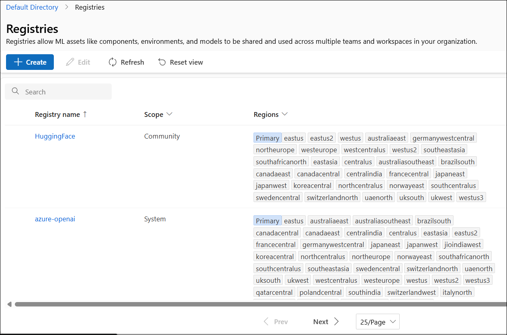

## Shared Assets Section

These resources can be reused across ML pipelines.

### Components

**What it is:**
Reusable **steps in ML pipelines**.

Example pipeline:

```text
Data preparation
Model training
Model evaluation
Deployment
```

Each step can be saved as a **component**.

**Interview one-liner:**

> Components are reusable building blocks used in machine learning pipelines.

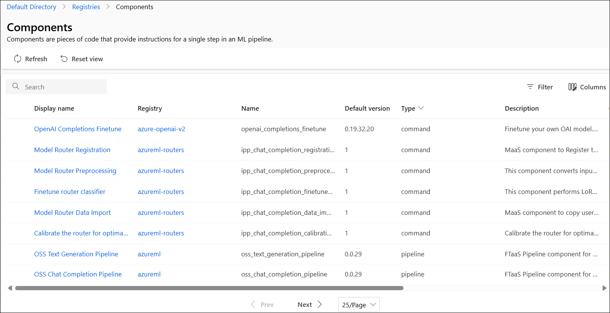

### Environments

**What it is:**
Defines the **runtime environment for ML jobs**.

Includes:

* Python version
* libraries
* dependencies

Example:

```text
Python 3.10
scikit-learn
pandas
tensorflow
```

**Interview one-liner:**

> An environment defines the software dependencies required to run ML training or inference.

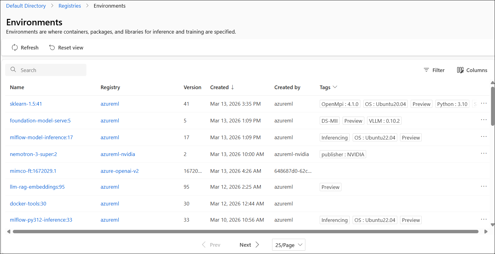

### Models

**What it is:**
A **model registry inside the workspace**.

Stores:

* trained models
* model versions
* metadata

Example:

```text
fraud-detection-model
  ├ v1
  ├ v2
```

**Interview one-liner:**

> The model registry stores trained ML models and their versions for deployment and reuse.

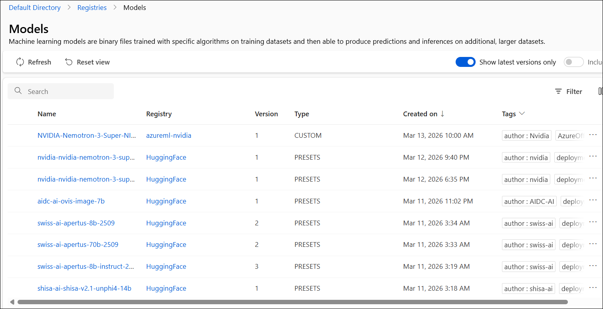

### Data

**What it is:**
Registered datasets used for training or inference.

Examples:

* CSV datasets
* image datasets
* parquet files
* data lake datasets

**Interview one-liner:**

> The data section manages datasets used for machine learning experiments and training.

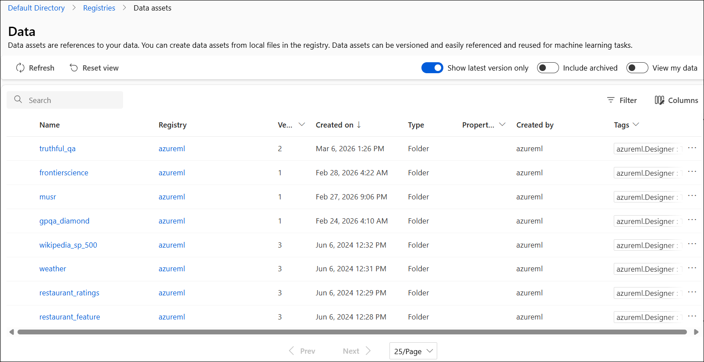

## Admin

Administrative configuration of ML resources.

### Quota

**What it is:**
Defines **resource limits for compute usage**.

Examples:

* number of GPUs
* CPU cores
* cluster size

**Why it matters**

Prevents excessive resource consumption.

**Interview one-liner:**

> Quotas define limits on compute resources such as CPUs, GPUs, and clusters used in Azure ML.

### Simple Architecture View

```text
Azure ML
   │
   ├─ Workspaces → ML project environments
   │
   ├─ Feature Store → reusable ML features
   │
   ├─ Registries → shared models/assets
   │
   └─ Shared assets
        ├─ Components → pipeline steps
        ├─ Environments → dependencies
        ├─ Models → trained models
        └─ Data → datasets
```

### Quick Interview Cheat Sheet

| Component     | Purpose                           |
| ------------- | --------------------------------- |
| Workspace     | Main ML project container         |
| Feature Store | Store reusable ML features        |
| Hub           | Shared resources across projects  |
| Registry      | Share ML assets across workspaces |
| Components    | Reusable pipeline steps           |
| Environments  | Software dependencies             |
| Models        | Model version registry            |
| Data          | Registered datasets               |
| Quota         | Compute resource limits           |

---

✅ **One-line summary**

> Azure Machine Learning organizes the ML lifecycle through workspaces, shared assets, registries, and compute management to build, train, and deploy machine learning models efficiently.

## Create Workspace 

### Basic 

| Field                    | What it is                                                     | Purpose / Why it is needed                                                                 |
| ------------------------ | -------------------------------------------------------------- | ------------------------------------------------------------------------------------------ |
| **Subscription**         | The Azure subscription where the workspace will be created.    | Determines billing and resource ownership for the ML workspace.                            |
| **Resource Group**       | A logical container that holds related Azure resources.        | Helps organize and manage resources such as the ML workspace, storage, and compute.        |
| **Name**                 | Unique name of the Azure Machine Learning workspace.           | Identifies the ML workspace where experiments, models, and pipelines are managed.          |
| **Region**               | The Azure datacenter location where the workspace is deployed. | Determines where the ML resources and compute infrastructure will run.                     |
| **Storage Account**      | Azure storage associated with the workspace.                   | Stores datasets, experiment outputs, logs, and model artifacts.                            |
| **Key Vault**            | Secure Azure service for managing secrets and credentials.     | Stores sensitive information such as API keys, passwords, and connection strings securely. |
| **Application Insights** | Azure monitoring and logging service.                          | Tracks performance, logs, and telemetry for ML experiments and deployed models.            |
| **Container Registry**   | Azure Container Registry used for storing Docker images.       | Stores container images used for training environments and model deployments.              |

### Simple Architecture View

```text
Azure ML Workspace
      │
      ├── Storage Account → stores datasets & model outputs
      ├── Key Vault → stores secrets & credentials
      ├── Application Insights → monitoring & logs
      └── Container Registry → Docker images for training/deployment
```

> An **Azure Machine Learning workspace** is the central environment for ML development and automatically integrates services like **Storage, Key Vault, Application Insights, and Container Registry** to support training, deployment, and monitoring of machine learning models.

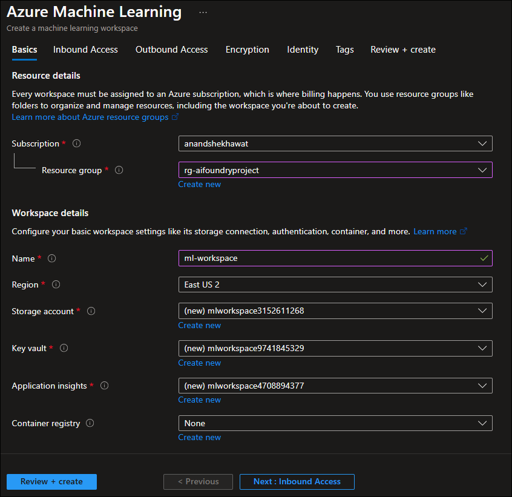

### Inbound Access

Below is a **concise tabular explanation of the “Inbound Access” tab** when creating a workspace in Azure Machine Learning.

| Field                                | What it is                                                                                                                 | Purpose / Why it is needed                                                                             |
| ------------------------------------ | -------------------------------------------------------------------------------------------------------------------------- | ------------------------------------------------------------------------------------------------------ |
| **Public network access**            | Controls whether the workspace can be accessed over the public internet. Options include **Disabled** or **All networks**. | Used to restrict or allow internet access to the workspace for security purposes.                      |
| **Disabled (Public network access)** | Blocks all public internet traffic to the workspace. Access is only allowed through private endpoints.                     | Used in highly secure or enterprise environments where internet access must be restricted.             |
| **All networks**                     | Allows the workspace to be accessed from any network over the internet.                                                    | Commonly used in labs, development environments, or when open access is acceptable.                    |
| **Workspace inbound access**         | Defines private network access to the workspace using **Private Endpoints**.                                               | Enables secure communication between Azure resources and the ML workspace within a private network.    |
| **Private Endpoint (Add)**           | Allows creating a private endpoint connected to a specific virtual network and subnet.                                     | Ensures traffic to the workspace flows through Azure's private network instead of the public internet. |
| **Subnet**                           | A segment of a virtual network used for private endpoint connections.                                                      | Controls network isolation and traffic routing within the VNet.                                        |
| **Private DNS Zone**                 | Azure DNS service that maps the private endpoint to the workspace’s private IP address.                                    | Ensures internal resources resolve the workspace hostname to its private IP.                           |

> The **Inbound Access configuration in Azure Machine Learning** controls how clients connect to the workspace, allowing either **public internet access or secure private network access through private endpoints**.


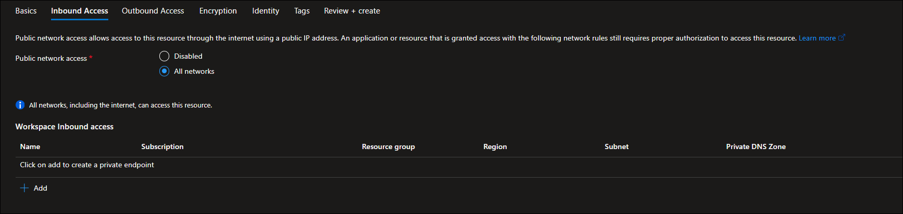

### Outbound 


| Option                           | What it is                                                                                                                   | Purpose / When to use                                                                               |
| -------------------------------- | ---------------------------------------------------------------------------------------------------------------------------- | --------------------------------------------------------------------------------------------------- |
| **Public**                       | Allows compute resources in the workspace to access public internet resources without restrictions.                          | Suitable for development, testing, or labs where unrestricted internet access is acceptable.        |
| **Allow Internet Outbound**      | Allows compute resources to access both public internet resources and private resources within virtual networks.             | Used when workloads need to access external services and internal private resources simultaneously. |
| **Allow Only Approved Outbound** | Restricts outbound network traffic so compute resources can only communicate with explicitly approved services or endpoints. | Used in highly secure enterprise environments where strict network control is required.             |

### Concept

Outbound access defines **how Azure Machine Learning compute resources communicate with external services** such as:

* Azure Storage
* Container registries
* external APIs
* internet resources

### Simple Architecture View

```text
Azure ML Workspace
        │
        ├─ Public → unrestricted internet access
        │
        ├─ Allow Internet Outbound → internet + private network access
        │
        └─ Allow Only Approved Outbound → restricted access to approved services only
```


> **Outbound Access in Azure Machine Learning controls how workspace compute resources communicate with external services, allowing either unrestricted internet access or restricted communication with approved endpoints for enhanced security.**

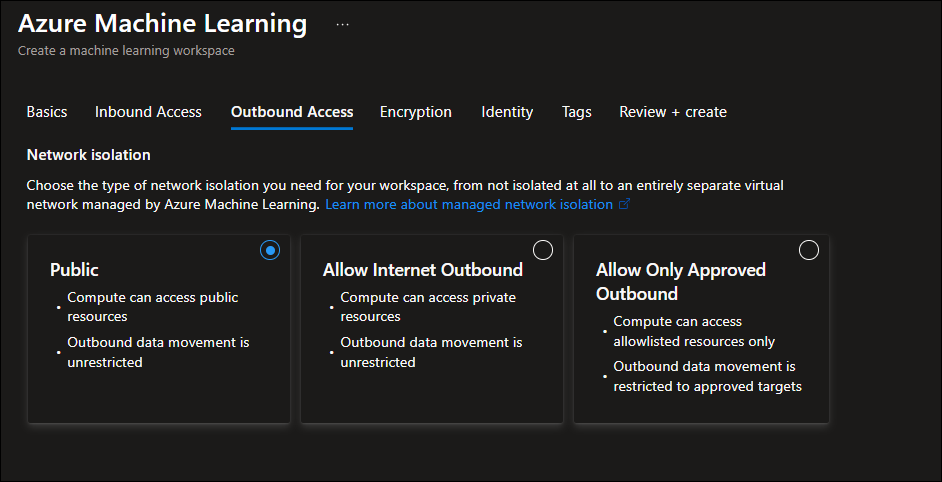

### Identity 


| Field                              | What it is                                                                                                                    | Purpose / When to use                                                                                      |
| ---------------------------------- | ----------------------------------------------------------------------------------------------------------------------------- | ---------------------------------------------------------------------------------------------------------- |
| **Managed Identity**               | An Azure feature that allows services to authenticate securely to other Azure services without storing credentials.           | Used so the ML workspace can securely access resources like Storage, Key Vault, or Container Registry.     |
| **System Assigned Identity**       | An identity automatically created and managed by Azure for the workspace. It is tied to the lifecycle of the workspace.       | Recommended for most scenarios where the workspace needs secure access to Azure resources.                 |
| **User Assigned Identity**         | A standalone identity created separately and then assigned to one or more Azure resources.                                    | Used when multiple services need to share the same identity or permissions.                                |
| **Storage Account Access Type**    | Defines how the workspace accesses the associated storage account. Options include credential-based or identity-based access. | Controls authentication method when accessing datasets, logs, and model artifacts stored in Azure Storage. |
| **Credential-based Access**        | Uses stored credentials or keys to authenticate with the storage account.                                                     | Simpler setup but less secure compared to identity-based access.                                           |
| **Identity-based Access**          | Uses Azure managed identity and RBAC permissions to access storage securely.                                                  | Preferred in enterprise environments for improved security and credential management.                      |
| **High Business Impact Workspace** | A setting for workspaces that handle sensitive or regulated data.                                                             | Enables additional data protection controls and limits diagnostic data collection.                         |

### Concept

Identity settings control **how the Azure ML workspace securely interacts with other Azure services** without embedding secrets or credentials.

### Simple Architecture View

```text
Azure ML Workspace
        │
        ├── Managed Identity
        │       │
        │       ├── Access Storage Account
        │       ├── Access Key Vault
        │       └── Access Container Registry
```


> **The Identity configuration in Azure Machine Learning enables secure authentication between the workspace and other Azure services using managed identities instead of storing credentials.**

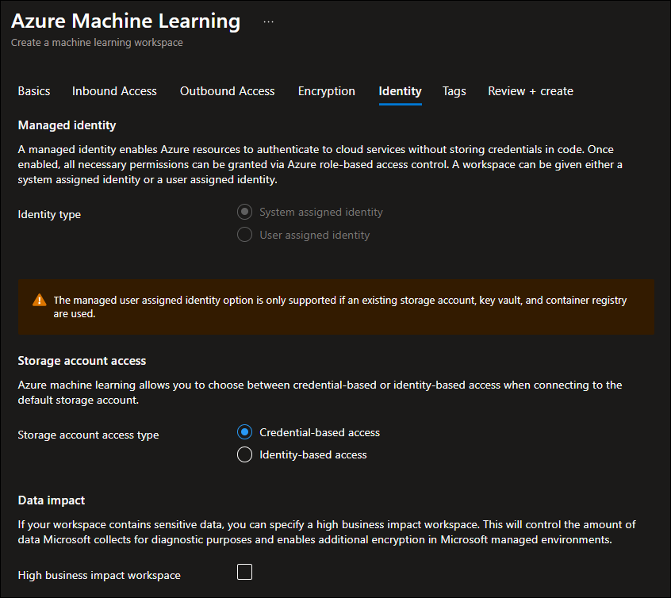

## Create Workspace through ML Studio

1. **ML Studio URL**
   This is the Azure Machine Learning Studio (`ml.azure.com`) where you can manage and create ML resources directly via UI instead of the Azure Portal.

2. **Workspaces**
   Navigate to **Workspaces** from the left pane. This is where all your existing ML workspaces are listed and managed.

3. **+ New**
   Click **+ New** to initiate the creation of a new Azure ML workspace.

4. **Name**
   Provide a **unique workspace name** (e.g., `mlops-workspace`).
   This is the actual resource name used internally in Azure.

5. **Friendly Name**
   A **display name** for easier identification (can include spaces).
   This is mainly for readability in the UI and does not need to be unique.

6. **Subscription**
   Select the Azure **subscription** under which the workspace will be created.
   This determines billing and resource ownership.

7. **Resource Group (RG)**

   * You can **select an existing Resource Group** (e.g., `demo`)
   * Or click **Create new** to create a new one
     Resource Groups help logically organize and manage related Azure resources.

8. **Region**
   Choose the **Azure region** (e.g., *East US 2*).
   This defines where your resources are physically hosted.
   👉 Best practice: Select a region close to your users or other dependent resources.

9. **Hub (Optional)**
   A **Hub** allows you to host the workspace in a **shared environment** with:

   * Centralized governance
   * Shared compute and resources
   * Pre-configured security and policies
     👉 If not required for your lab, you can leave this empty.

10. **Create**
    Click **Create** to provision the workspace with the selected configuration.

    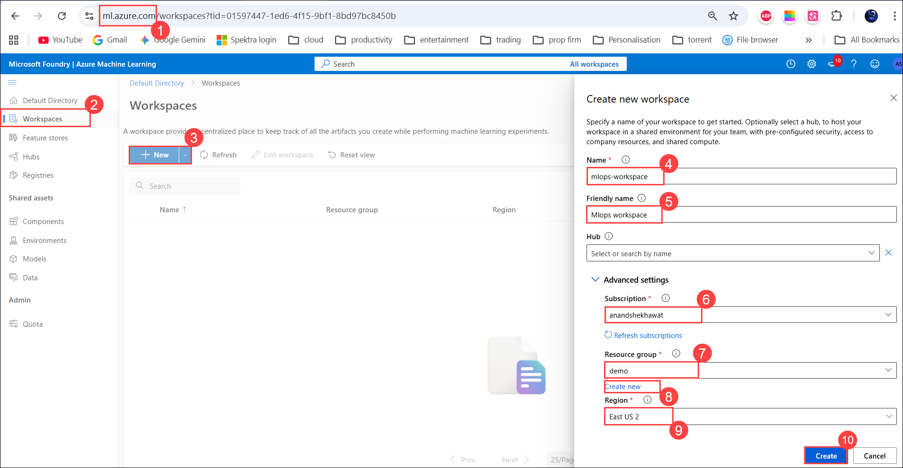

### AML Workspace

Now we are in the workspace that we have created:

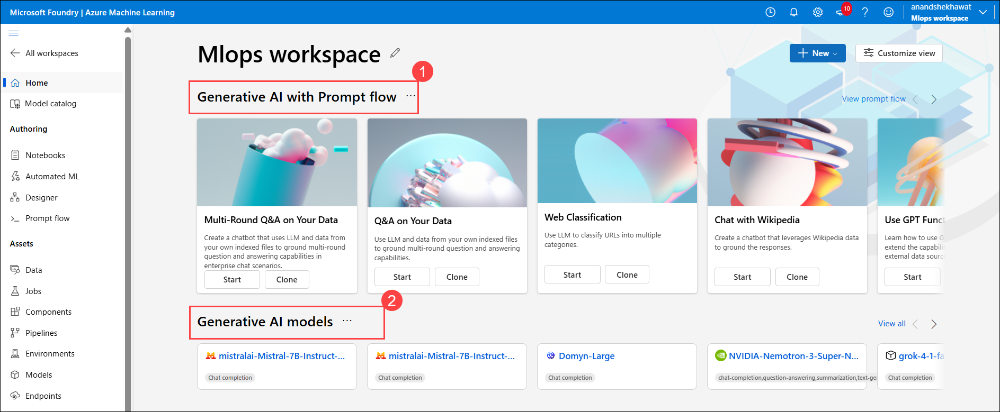

#### **1. Generative AI with Prompt flow**

This section provides **prebuilt templates and tools to create, test, and deploy AI applications** using large language models (LLMs).

#### What it is

* A **low-code / visual development environment** for building GenAI apps
* Lets you design workflows (called *flows*) that combine:

  * Prompts
  * LLMs
  * Data sources
  * Logic (conditions, chaining, etc.)

#### What you can do here

* Create chatbots or Q&A systems
* Connect your own data (PDFs, databases, etc.)
* Test prompts and evaluate responses
* Deploy flows as APIs

#### How it works (simple explanation)

Think of it like:

> “A pipeline where input → prompt → AI model → output”

You define how data flows between steps visually.

#### Example

**Use case: Company FAQ chatbot**

* You upload company documents
* Use **“Q&A on Your Data”**
* Prompt flow connects:

  * User question → Search documents → Send context to LLM → Generate answer

  >Result: A chatbot that answers based on your company data, not just general knowledge

#### **2. Generative AI models**

This section shows the **actual AI models** available in your workspace that you can use in Prompt flow or other applications.

#### What it is

* A catalog of **pretrained foundation models**
* These models are ready to use via APIs or integrated into flows

#### Types of models you’ll see

* Chat models (for conversations)
* Completion models (text generation)
* Specialized models (summarization, classification, etc.)

Examples from your screen:

* **Mistral-7B-Instruct** → lightweight chat model
* **Domyn-Large** → more powerful model
* **NVIDIA Nemotron** → advanced enterprise model

#### What these models do

They are the **“brains”** behind your AI application.

Without them:

* Prompt flow = structure only
* Models = intelligence

Together → complete AI solution

Now we are in the workspace that we have created:


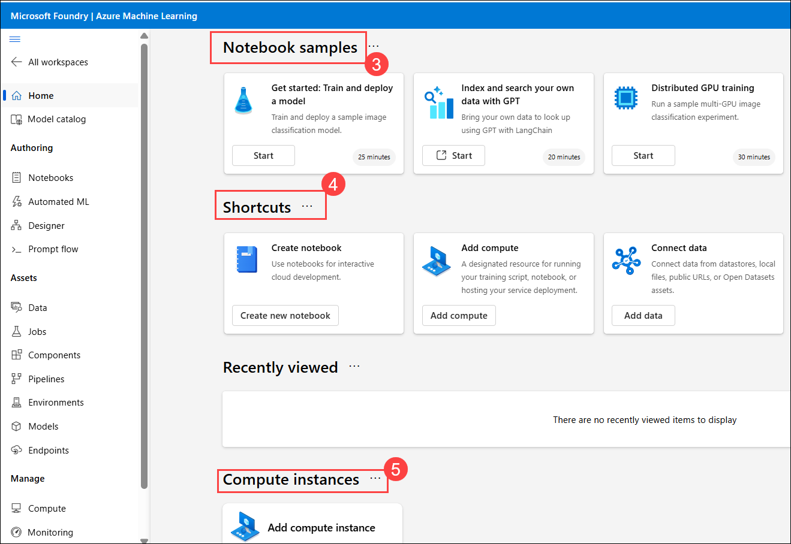

#### **3. Notebook samples**

This section provides **ready-to-use sample notebooks** to help you quickly get started with common ML and AI scenarios.

#### What it is

* A collection of **prebuilt Jupyter notebooks**
* Covers common use cases like training models, GPT-based apps, and GPU workloads

#### What you can do here

* Learn by running guided examples
* Train and deploy models step-by-step
* Explore GenAI scenarios like indexing and search
* Understand distributed and GPU-based training

#### How it works (simple explanation)

Preconfigured notebooks with code, instructions, and environment setup are provided so you can execute them directly without building everything from scratch.

#### Example

**Use case: Train and deploy a model**

* Select **“Train and deploy a model”**
* Run the notebook cells step-by-step
* Model gets trained and deployed

> Result: A working ML model with minimal setup effort

#### **4. Shortcuts**

This section provides **quick access actions** to commonly used workspace operations.

#### How it works (simple explanation)

Instead of navigating through multiple menus, shortcuts allow you to directly start essential tasks from the workspace home.

#### **5. Compute instances**

This section is used to **create and manage compute resources** required to run notebooks, training jobs, and experiments.

#### What it is

* A **managed virtual machine** dedicated to your development work in Azure ML

#### What you can do here

* Create a compute instance
* Run notebooks and scripts
* Install libraries and dependencies
* Execute ML training workloads

#### How it works (simple explanation)

You create a compute instance, and it acts like your personal cloud machine where all development and execution happens.

#### Example

**Use case: Run a notebook**

* Create a compute instance
* Attach it to a notebook
* Run code directly on that machine

> Result: Scalable execution without relying on local system resources

### Notebook

1. A notebook in Azure Machine Learning is an interactive environment (Jupyter notebook) used to write and run code, visualize results, and document experiments in one place. It is mainly used for data exploration, model training, and testing machine learning workflows. You can execute code step-by-step, making it easy to debug and iterate. For example, you can load a dataset, clean it, train a model, and visualize performance metrics—all within the same notebook. It runs on a compute instance, so you don’t rely on your local machine and can scale resources as needed.

        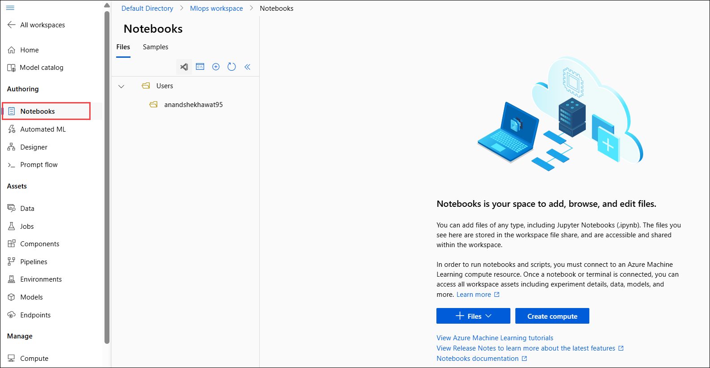

### Automated ML

1. Automated ML in Azure Machine Learning is used to automatically build, train, and select the best machine learning model based on your data without requiring manual coding or deep ML expertise. It simplifies the end-to-end process by trying multiple algorithms, tuning hyperparameters, and evaluating performance to identify the optimal model. This is especially useful for users who want quick results or are new to ML. For example, you can upload a dataset (like sales data), select a target column, and Automated ML will generate and recommend the best model for predicting future sales.

 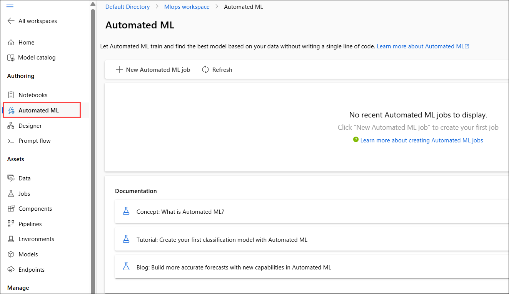

### Designer

1. The **Designer** in Azure Machine Learning is a **low-code, drag-and-drop interface** used to build machine learning pipelines visually without writing extensive code. It allows you to connect components like data input, preprocessing, training, and evaluation into a workflow (pipeline). You can use **prebuilt (classic)** components for quick development or create **custom pipelines** for more flexibility. Pipelines help automate and standardize ML processes. For example, you can drag a dataset → add a data cleaning step → train a model → evaluate results, all visually. Once created, pipelines can be saved as drafts or executed as jobs for repeatable ML workflows.

 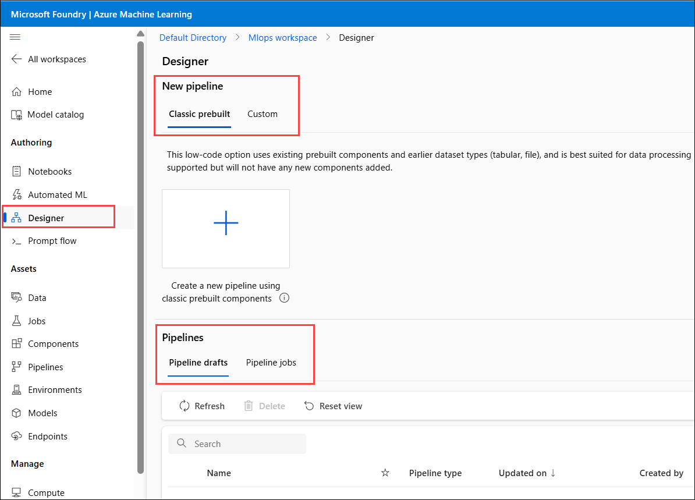

### Prompt-flow

Prompt flow in Azure Machine Learning is used to **build, manage, and evaluate generative AI workflows (flows)** using large language models. It provides a structured way to design how prompts, models, and data interact.

* **Flows**: Create and manage prompt-based workflows (e.g., chatbot, Q&A system)
* **Runs**: View execution history and results of flows
* **Connections**: Manage external resources (e.g., OpenAI, data sources)
* **Runtime**: Configure compute/environment used to run flows
* **Vector index**: Store and search embeddings for retrieval-based scenarios

For example, you can create a flow where a user question → searches documents via vector index → sends context to an LLM → generates an accurate answer.

 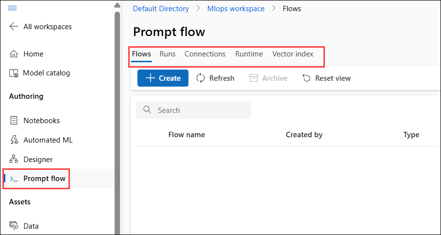

### Data

The **Data** section in Azure Machine Learning is used to **manage and organize datasets** required for ML workflows.

* **Data assets**: These are **registered datasets** (files, folders, tables) that you can version, reuse, and share across experiments. Instead of hardcoding paths, you reference data assets, making workflows consistent and reproducible.

 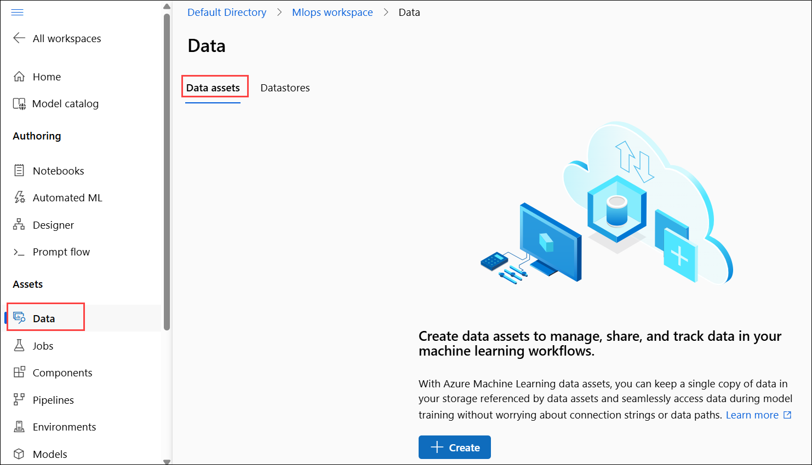

* **Datastores**: These are **connections to storage services** (like Azure Blob Storage, Data Lake) where your actual data is stored. They act as a secure bridge between your workspace and storage.

 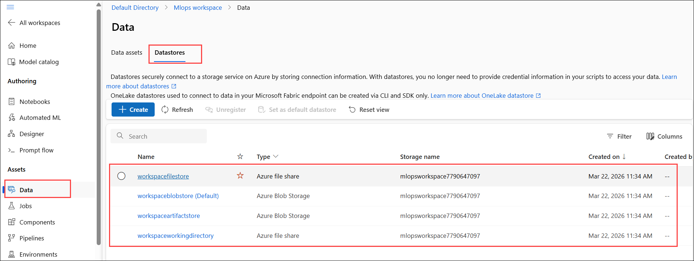

For example, you can register a CSV file as a **data asset** and use it in training, while the file itself resides in a datastore like Blob Storage.

#### Datastore 
The **Datastores** section in Azure Machine Learning is used to **securely connect your workspace to underlying storage services** like Azure Blob Storage or File Shares, where your actual data is stored.

* These act as a **bridge between your workspace and storage**, so you don’t need to hardcode credentials or paths in your code
* Default datastores are automatically created with the workspace

For example, when you upload a dataset or run training, the data is stored in the blob datastore, and your ML jobs access it securely through these datastore connections.

### Jobs

The **Jobs** section in Azure Machine Learning is used to **track, manage, and monitor all ML executions (runs)** such as training, testing, or pipeline runs.

* **All experiments**: Groups related runs together for better organization
* **All jobs**: Shows individual executions with status, logs, and results
* **All schedules**: Manages recurring or scheduled runs

It helps you monitor progress, debug issues, and compare results across runs.

For example, when you train a model multiple times with different parameters, each run is logged as a job, allowing you to track performance and identify the best model.

### Components

The **Components** section in Azure Machine Learning is used to create and manage **reusable building blocks** for ML workflows.

* Components represent **individual steps** like data preprocessing, model training, or evaluation
* Each component has defined **inputs, outputs, parameters, and environment**
* They can be reused across multiple pipelines, ensuring consistency and reducing duplication
 
 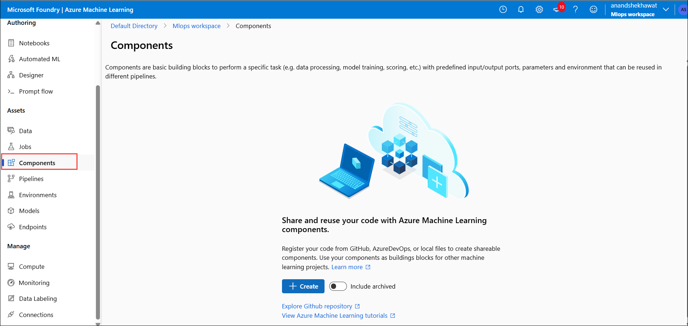

This helps in modularizing ML workflows and making them easier to maintain and scale.

For example, you can create a data cleaning component once and reuse it in multiple pipelines instead of rewriting the same code each time.

### Pipelines

The **Pipelines** section in Azure Machine Learning is used to **create, manage, and run end-to-end ML workflows** by combining multiple steps into a single automated process.

* **Pipeline jobs**: View and track executed pipeline runs
* **Pipeline endpoints**: Deploy pipelines as reusable APIs for repeated execution
* **Pipeline drafts**: Save and edit pipelines before running them

Pipelines help automate tasks like data preparation, training, and evaluation in a structured and repeatable way.

For example, you can build a pipeline where data ingestion → preprocessing → model training → evaluation runs automatically every time new data is available.

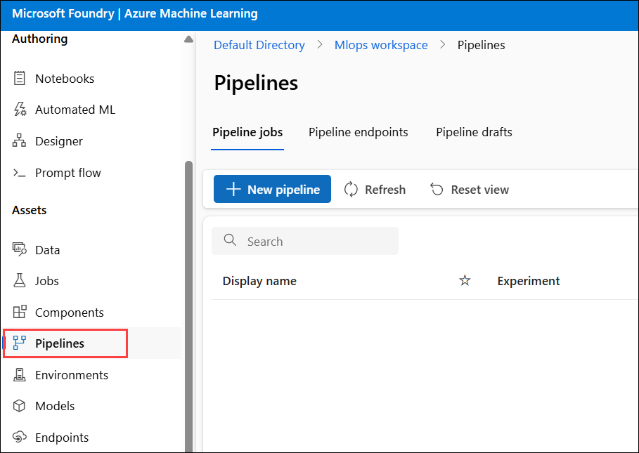

### Environments

The **Environments** section in Azure Machine Learning is used to **define and manage the runtime setup** required to run ML code, including libraries, dependencies, and system configurations.

* **Curated environments**: Prebuilt, Microsoft-managed environments with commonly used libraries (e.g., Python, ML frameworks). These are ready to use and optimized for faster execution.
* **Custom environments**: User-defined environments where you can specify your own packages, versions, and configurations using Docker or conda.

Environments ensure consistency and reproducibility across experiments and pipelines.

For example, if your model requires specific versions of Python and libraries like scikit-learn, you can define an environment once and reuse it across multiple training jobs.

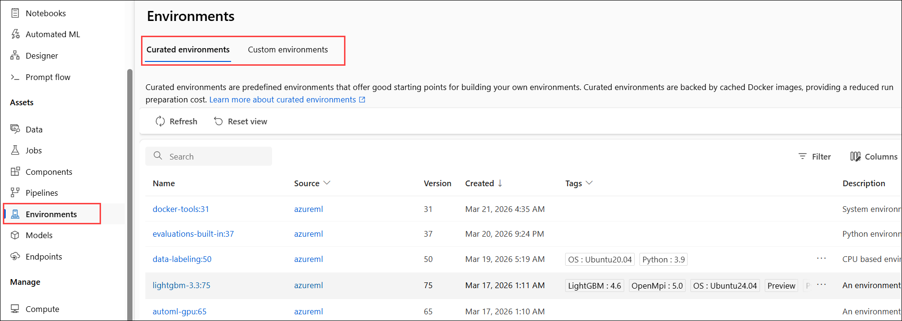

### Models

The **Models** section in Azure Machine Learning is used to **register, manage, and version machine learning models**.

* It stores trained models in a centralized place
* Supports **versioning**, so multiple iterations of the same model can be tracked
* Allows adding metadata (tags, descriptions) for better organization

This helps in managing the lifecycle of models from training to deployment.

For example, after training a model, you can register it here as version 1. If you retrain with better accuracy, you register it as version 2 and compare both before deploying the best one.

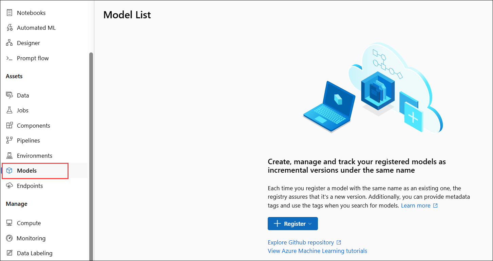

### Endpoints

The **Endpoints** section in Azure Machine Learning is used to **deploy trained models and make them accessible for predictions (inference)**.

* **Real-time endpoints**: Used for **instant predictions** via APIs (low latency)
* **Batch endpoints**: Used for processing **large volumes of data in bulk**
* **Azure OpenAI**: Access and manage OpenAI models for generative AI use cases
* **Serverless endpoints**: Deploy models without managing infrastructure

Endpoints allow you to integrate ML models into applications.

For example, a real-time endpoint can be used in a web app to instantly predict loan approval, while a batch endpoint can process thousands of records overnight.

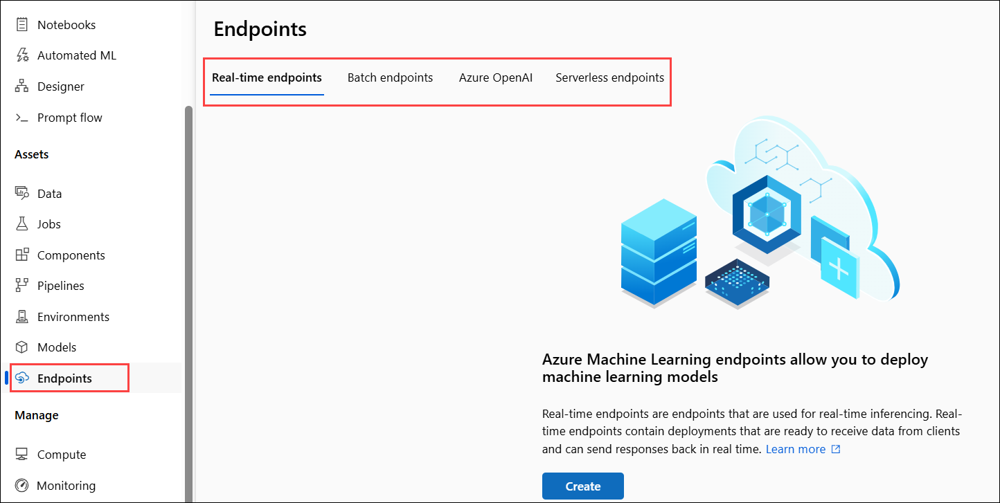

### Compute

The **Compute** section in Azure Machine Learning is used to **create and manage the infrastructure required to run ML workloads** such as notebooks, training jobs, and deployments.

* **Compute instances**: Personal development VMs for running notebooks and code
* **Compute clusters**: Scalable clusters for training jobs (auto-scale up/down)
* **Kubernetes clusters**: Used for deploying models in production (AKS-based)
* **Attached computes**: External compute resources linked to the workspace
* **Serverless instances**: Run workloads without managing infrastructure

Compute provides the processing power (CPU/GPU) needed for ML tasks.

For example, you can use a compute instance for development and a compute cluster to train models on large datasets efficiently.

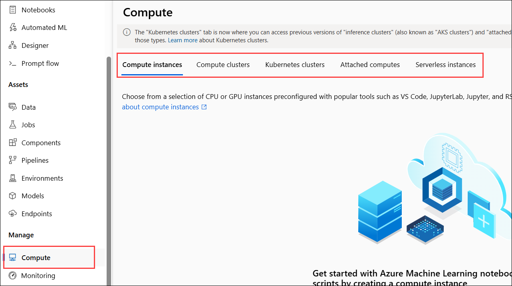

### Monitoring

The **Monitoring** section in Azure Machine Learning is used to **track and analyze model performance after deployment (in production)**.

* Monitors metrics like accuracy, latency, and usage
* Detects issues such as **data drift** and **prediction drift**
* Helps ensure models continue to perform as expected over time
* Can trigger alerts when performance degrades

This is essential for maintaining reliable and trustworthy ML systems in real-world scenarios.

For example, if a fraud detection model starts receiving new types of transactions and accuracy drops, monitoring will detect the drift and alert you to retrain the model.

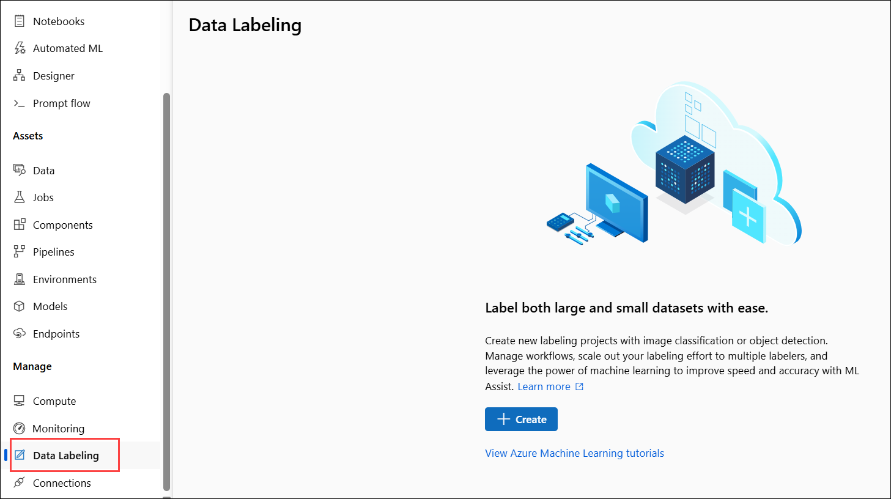

### Data labeling

The **Data Labeling** section in Azure Machine Learning is used to **annotate datasets with labels required for training supervised machine learning models**.

* Supports tasks like **image classification, object detection, and text labeling**
* Allows multiple users to collaborate on labeling projects
* Helps improve dataset quality and model accuracy
* Can use ML-assisted labeling to speed up the process

Labeling is essential because models learn from labeled data.

For example, in an image classification project, you can label images as “cat” or “dog,” which is then used to train a model to automatically classify new images.


### Connections

The **Connections** section in Azure Machine Learning is used to **securely connect your workspace to external resources and services** such as storage accounts, APIs, or other Azure services.

* Stores **connection details and authentication methods** (e.g., SAS, account key)
* Eliminates the need to hardcode credentials in code or pipelines
* Enables seamless integration with data sources and services

These connections are used across workflows like data access, model training, and deployments.

For example, you can create a connection to an Azure Blob Storage account and use it in your pipelines or notebooks to read/write data securely without exposing credentials.

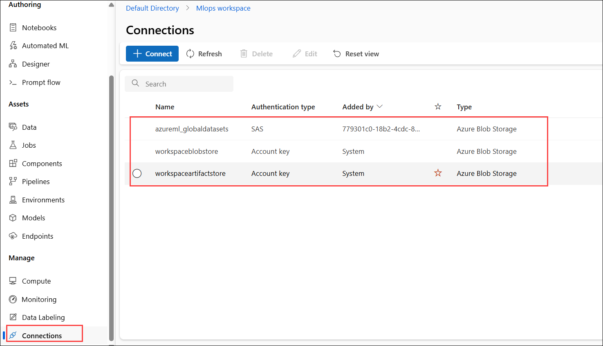